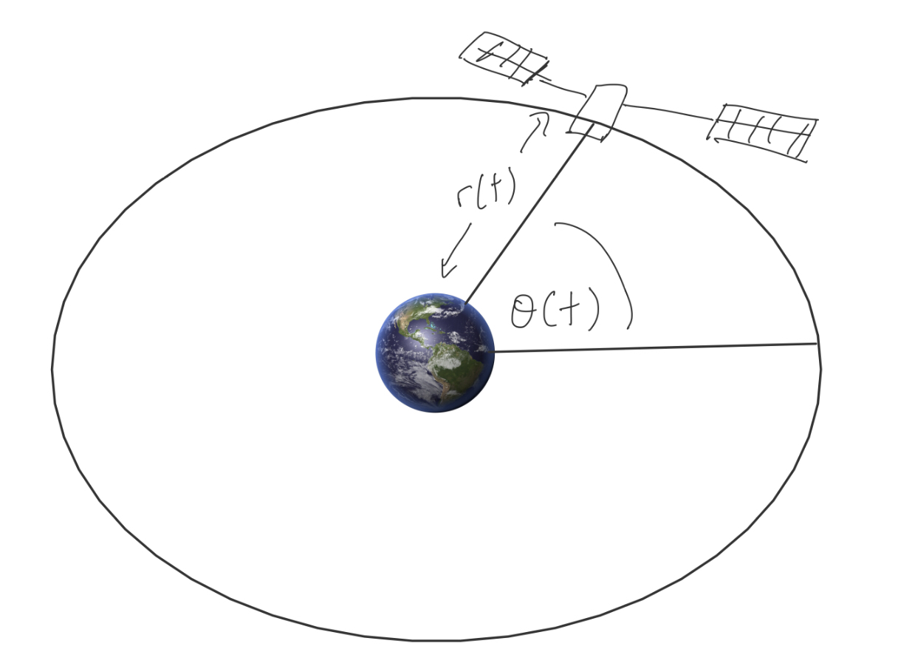

<!-- Generated by ipynb_to_quarto.py. Review before publication. -->
<!-- Source SHA-256: 5b41ca7d914d57ed8e908fa2cce448506794160264e6367cbe72dad4a572598b -->

# Øving 2: Satellittbaner



## Bakgrunn

Vi undersøker hvordan en satellitt dreier seg rundt et større legeme under påvirkning av tyngdekraft. Det er lettest å bruke polarkoordinater $r(t), \theta(t)$, hvor vi antar at banen beveger seg ikke utenfor et 2-dimensjonalt plan. Newtons ligninger gir systemet:
$$
\begin{align}
\ddot{r} - r\dot{\theta}^2 &= -\frac{GM}{r^2} \\
r^2 \dot{\theta} &= h
\end{align}
$$

## En ligningen: fasongen

Newton hadde ikke datamaskin, men oppdaget en smart metode å løse ligningen. Han ville beregne $r=r(\theta)$, altså eliminerte han tid fra ligning og let etter avstand som en funksjon av vinkelen. Dermed kjørte han substitusjonen $u=r^{-1}$. Resultatet ble ligningen
$$
\frac{d^2 u}{d\theta^2} + u = \frac{GM}{h^2},
$$
hvor $h$ er satellitens dreiemoment.

## Oppgaver

1. Finn en analytisk løsning $u=u(\theta)$ til systemet.
2. Sett tilbake $r=u^{-1}$.
3. Plott $r=r(\theta)$ for forskjellige parameterverdier. Hva slags muligheter er det?

## Løsningen

vi har en generell løsning

$$ u = A \sin(u) + B \cos(u) + \frac{GM}{h^2}$$

eller alternativt

$$
u = A \cos(u + u_0) + \frac{GM}{h^2}
$$

Er vi litt smart ser vi at vi kan ta $u_0=0$ "wlog" (altså vi klarer det ved en koordinatbytte), slik at

$$
r = u^{-1} = \frac{l}{1+e\cos(\theta)},
$$

som er en paramtrisering av en kjeglesnitt med eksentrisitet $e=Al$ og "semi latus rectum" $l=\frac{h^2}{GM}$. Noen eksempler er tegnet under

```{python}
#| label: cell-3
#| echo: true
import numpy as np
import matplotlib.pyplot as plt

def r(theta, e, l):
    return l / (1 + e*np.cos(theta))

theta = np.linspace(0, 2*np.pi, 100)
theta2 = np.linspace(-0.75*np.pi, 0.75*np.pi, 100)

fig, (ax1, ax2, ax3) = plt.subplots(1, 3, subplot_kw={'projection': 'polar'}, figsize=(20,12))

ax1.plot(theta, r(theta, 0.2, 2))
ax2.plot(theta, r(theta, 1, 2))
ax3.plot(theta, r(theta2, 1.2, 2))

# Man kan få rare resultater på hyperbolaer hvis man bruker theta som parameter, se 3. graf
```

```{python}
#| label: cell-4
#| echo: true

```
