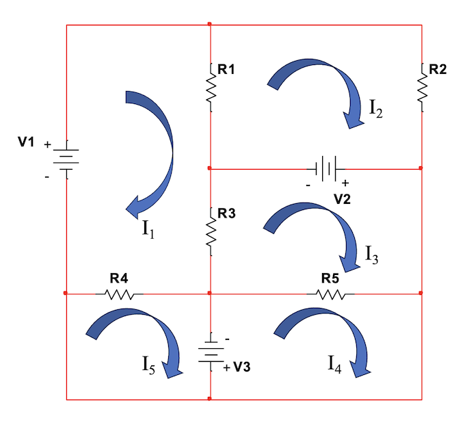

<!-- Generated by ipynb_to_quarto.py. Review before publication. -->
<!-- Source SHA-256: c2e6b2e4d9716745ec4b0b2d4445fdb52fff6b8308395981628c379cd08670c0 -->

# Kirchhoffs lover og lineær algebra

Vi har sett at analyse av tidsavhengige kretser innebærer å sette opp et lineært ligningssystemet. Så langt har vi sett relativt enkle eksempler med få ukjent. Men betrakt følgende krets:



Ikke spesielt komplisert å sette opp kretsen fysisk, men å løse den uten teknikker fra lineær algebra blir vanskelig. Enda lettere blir det om vi tar i bruk programmering også! 

## Oppgave 1

Koden for hvordan man løser et lineært system er gitt under. Erstatt A og v med verdier fra kretsen over (velg motstand og spenning slik du vil, uten å sette alle til null) og løs systemet.

::: {.callout-warning title="Mulig kodeoppgave"}
Kodecelle 4 følger en oppgavetekst og kan vurderes for `py-exercise` eller en interaktiv Pyodide-celle.
:::

::: {.callout-warning title="Mulig løsningscelle"}
Kodecelle 4 er merket eller formulert som en mulig løsning. Vurder å flytte den til lærermaterialet.
:::

```{python}
#| label: cell-4
#| echo: true
import numpy as np

# matrisa til systemet:
A = np.array([[1,2],[3,4]])

# en vektor med spenninger
v = np.array([5,6])

print(A)

# løsning av AI = V, en vektor med strømmer
I = np.linalg.solve(A,v)

print(I)
```

## Oppgave 2

Det er på tid å reflektere litt mer over forhold mellom det du har lært i matematikk 1 så langt og analyse av slike kretser.

1. Tror du det finnes en elektrisk krets som tilsvarer etthvert lineært ligningssystem? Prøv noen enkle eksempler: ha en gruppemedlem finne på en matrise, og la de andre forsøke å komme på en krets.
2. Kan du finne en krets som gir et ligningssystem uten løsninger? Du kan ta i bruk avhengige kilder hvis det helper. Hva med ligningssystemer med flere løsninger?
3. Vi har vært bort i forskjellige teknikker for å bygge opp matrisa - maskeanalyse og nodeanalyse. Bruk begge på den samme kretsen. Hva er forholdet mellom systemene man får?

::: {.callout-warning title="Mulig kodeoppgave"}
Kodecelle 6 følger en oppgavetekst og kan vurderes for `py-exercise` eller en interaktiv Pyodide-celle.
:::

```{python}
#| label: cell-6
#| echo: true

```
