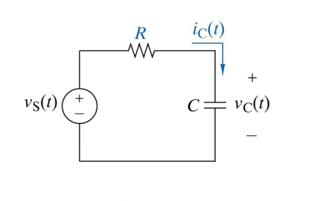

<!-- Generated by ipynb_to_quarto.py. Review before publication. -->
<!-- Source SHA-256: 8d88abb0438799efc774162159dc0005f5763fee213e696457e8b74497122a4f -->

# Tidsavhengige kretser

## Kondensator



En typisk krets med en kondensator er 
$$
R C\frac{dv_C}{dt} + v_C = v_s
$$

I en enkel utladingskrets vil $v_s = 0$, mens den blir ikke null når vi kobler på en spenningskilde. Da kan vi få oppladning istedet.

## Ikke-lineær kondensator

En ikke-lineær kondensator har $C=C(V)$. Fra nå av bruker vi $V$ for $v_C$. Vi får en ligning

$$
R \frac{d}{dt}(V C(V)) + V = V_s
$$

For eksempel, vi kan ta $C(V) = k\sqrt{V}$.

For å løse løgningen, bruker vi kjerneregelen: 

$$\frac{d}{dt}(V C(V)) = \frac{d}{dt}(k V^\frac{3}{2}) = \frac{3}{2}kV^\frac{1}{2}\frac{dV}{dt}$$

Vi får da en differensialligning

$$\frac{3kR}{2}V^\frac{1}{2}\frac{dV}{dt} + V = V_s$$

som kan skrives om til

$$\frac{dV}{dt} = \frac{2}{3kR} (-V^\frac{1}{2} + V_s V^{-\frac{1}{2}})$$

Vi løser ligningen i kodefeltet under, og sammenligner resultatet med en lineær kondensator.

```{python}
#| label: cell-2
#| echo: true
import numpy as np
import matplotlib.pyplot as plt

def euler(f,x0,a,b,N):
    t = np.linspace(a,b,N)
    x = np.zeros(N)
    x[0] = x0
    for i in np.arange(N-1):
        x[i+1] = x[i] + (t[i+1]-t[i])*(f(x[i],t[i]))
    return x,t

k = 1
R = 1
V0 = 10

def V(x,t):
    # Vi legger til np.sign og np.sqrt for å sørge for at det funker når V blir negativ.
    return (-2/(3*k*R))*np.sign(x)*np.sqrt(np.abs(x))

x, t = euler(V,V0,0,20,100)

RC = R*k*V0
y = V0*np.exp(-t/RC)

fig, ax = plt.subplots()

ax.plot(t,x)
ax.plot(t,y)
```

## Oppgave 1

Koden over sammenligner en lineær og en ikke-lineær kondensator.

1. Hva er parameterverdiene? Hvilken farge er linjen tilsvarende den lineære kondensatoren? 
2. Modifiser koden slik at du får en oppladningskrets.

## Spoler

Ligningen for en spoler er ganske lik den for en kondensator:

$$
RI + L\frac{dI}{dT} = V.
$$


## Oppgave 2

Sammenlign kretsen for en lineære spoler med en ikke-lineær med $L(I)=k\frac{1}{1+I^2}$. Ligningen er separable og lar seg løse analytisk, men innebærer et slemt integral. Det er mer ønskelig å bruke Eulers metode. Bruk koden under for å plotte svarene dine.

::: {.callout-warning title="Mulig kodeoppgave"}
Kodecelle 5 følger en oppgavetekst og kan vurderes for `py-exercise` eller en interaktiv Pyodide-celle.
:::

```{python}
#| label: cell-5
#| echo: true
def L1(x,t):
    return # sett inn svaret ditt her

def L2(x,t):
    return # sett inn svaret ditt her

I0 = 1
#t = linspace(0,10,100)

x1, t = euler(L1, I0, 0, 5, 1000)
x2, t = euler(L2, I0, 0, 5, 1000)

fig2, ax2 = plt.subplots()

ax2.plot(t,x1)
ax2.plot(t,x2)
```

## RLC-kretsen

En basic RLC krets (her seriekoblet) har ligning
$$
\frac{d^2 I}{dt^2} + \frac{R}{L} \frac{dI}{dt} + \frac{1}{LC} I = \frac{1}{L} \frac{dV_s}{dt}
$$

Har er $V_s=V_s(t)$ en kjent spenningskilde.

## Oppgave 3

1. Finn den generelle løsningen når høyresiden er lik null.
2. Gjør systemet om til et system av førsteordens ligninger.

::: {.callout-warning title="Mulig kodeoppgave"}
Kodecelle 8 følger en oppgavetekst og kan vurderes for `py-exercise` eller en interaktiv Pyodide-celle.
:::

```{python}
#| label: cell-8
#| echo: true

```
