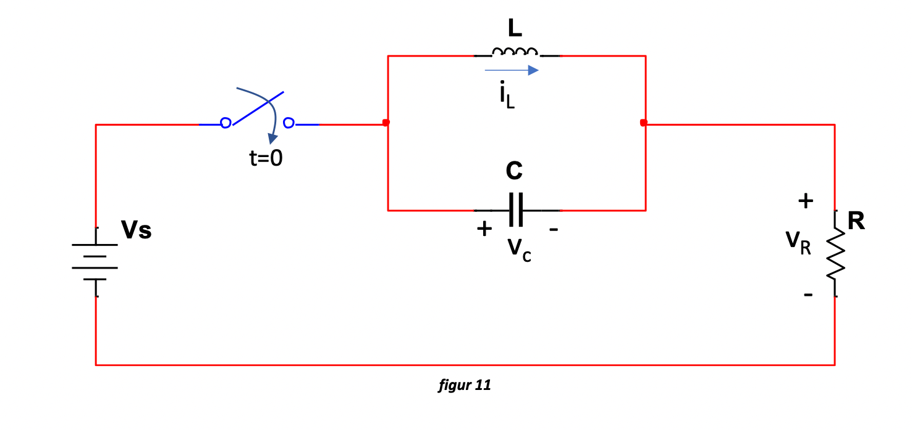
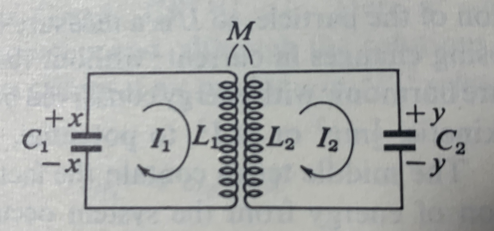

<!-- Generated by ipynb_to_quarto.py. Review before publication. -->
<!-- Source SHA-256: a2f2658a5b4ce4dcdc1e665d135344e754e1671ce9d5182f99b7b0cc5560359d -->

# Tidsavhengige kretser 2

## RLC-kretser 2

Vi fortsetter arbeidet med RLC-kretser. Her er fin krets:



## Oppgave 1:

1. Finn en andreordens differensialligning for $V_C(t)$
2. Finn en andreordens differensialligning for $I_l(t)$

## Løsning

1. Først får vi

$$
V_s = V_C + V_R = V_C + (i_L + i_C) R
$$

I tillegg har vi

$$
C\frac{dV_c}{dt} = i_C \Rightarrow C\frac{dV_C^2}{dt^2} = \frac{di_C}{dt}, \quad V_L = V_C = L\frac{di_L}{dt} \Rightarrow \frac{di_L}{dt} = \frac{V_C}{L}
$$

Vi deriverer den første ligningen

$$
\frac{dV_s}{dt} = \frac{dV_C}{dt} + R\frac{di_L}{dt} + R\frac{di_C}{dt}
$$

Så deler vi begge sider på $RC$ og setter inn de andre ligningene:

$$
\frac{1}{RC}\frac{dV_s}{dt} = \frac{dV_C^2}{dt^2} + \frac{1}{RC} \frac{dV_C}{dt} + \frac{1}{LC} V_C
$$

2. Nå kan vi tilbake til

$$
V_s = V_c + R(i_L + i_C) = L\frac{di_L}{dt} + R i_L + RC\frac{dV_c}{dt}
$$

I tillegg har vi

$$
\frac{dV_L}{dt} = \frac{dV_C}{dt} = L\frac{d^2i_L}{dt^2}
$$

Slik at

$$
V_s = L\frac{di_L}{dt}+ R i_L + RLC \frac{d^2 i_L}{dt^2} 
$$

Eller

$$
\frac{V_s}{RLC} = \frac{d^2 i_L}{dt^2} + \frac{1}{RC} \frac{di_L}{dt} + \frac{1}{LC} i_L
$$

## Diagonalisering

Vi kan heller sette opp systemet som et 2x2 system.

## Oppgave 2:

1. Diagonaliser matrisene (du kan velge verdiene av $R,L,C$ slik at det blir enklere)
2. Hva forteller egenverdiene/vektorene om oppførsel i tid?

## Løsning

La $v_C = v, \frac{dv_c}{dt} = u$, slik at vi får

$$
\dot{u} + \frac{1}{RC} u + \frac{1}{LC} v = \dot{v}_s, \quad \dot{v} = u
$$

Altså

$$
\frac{d}{dt} \begin{pmatrix}
u \\
v
\end{pmatrix}
= 
\begin{pmatrix}
-\frac{1}{RC} & -\frac{1}{LC} \\
1 & 0
\end{pmatrix}\begin{pmatrix}
u \\
v
\end{pmatrix}
+
\begin{pmatrix}
\dot{v}_s \\
0
\end{pmatrix}
$$

## Et koblet system



Se på følgende system, en veldig forenklet transformator.

$$
\frac{x}{C_1} - L_1 \frac{dI_1}{dt} - M\frac{dI_2}{dt} = -\frac{y}{C_2} - L_2\frac{dI_2}{dt} - M\frac{dI_1}{dt} = 0
$$

Som gir et system
$$
\frac{x}{C_1} + L_1 \ddot{x} - M \ddot{y} = 0
$$
$$
\frac{y}{C_2} + L_2 \ddot{y} - M \ddot{x} = 0
$$

Vi kan gjøre om ligningen til et 4x4 system, for så å finne egenverdiene/vektorene med datamaskin.

## Løsning

Skriv $u = \dot{x}, v = \dot{y}$ slik at $\ddot{x} = \dot{u}$ og $\ddot{y} = \dot{v}$

Vi får

$$
\frac{x}{C_1} + L_1 \dot{u} - M \dot{v} = 0
$$
$$
\frac{y}{C_2} + L_2 \dot{v} - M \dot{u} = 0
$$

Dvs vi har

$$
\begin{pmatrix}
L_1 & -M & 0 & 0 \\
-M & L_1 & 0 & 0 \\
0 & 0 & 1 & 0 \\
0 & 0 & 0 & 1
\end{pmatrix}
\begin{pmatrix}
\dot{u} \\
\dot{v} \\
\dot{x} \\
\dot{y}
\end{pmatrix}
=
\begin{pmatrix}
0 & 0 & -C_1 & 0 \\
0 & 0 & 0 & -C_2 \\
1 & 0 & 0 & 0 \\
0 & 1 & 0 & 0
\end{pmatrix}
\begin{pmatrix}
u \\
v \\
x \\
y
\end{pmatrix}
$$

```{python}
#| label: cell-7
#| echo: true
import numpy as np

# sett inn matrisa her A = np.array()

L1 = 1
L2 = 2
M = 5

C1 = 2
C2 = 3

X = np.array([[L1, -M, 0, 0],[-M,L1,0,0],[0,0,1,0],[0,0,0,1]])

Y = np.array([[0,0,-C1,0],[0,0,0,-C2],[1,0,0,0],[0,1,0,0]])

A = np.linalg.solve(X,Y)

everdier, evektorer = np.linalg.eig(A)

print(everdier)

print(evektorer)
```

## Oppgave 3:

1. Gjør om systemet til førsteordens 4x4
2. Finn egenverdiene/egenvektorene numerisk med koden over (velg verdier til $L_1,L_2,M,C_1,C_2$)
3. Hva forteller det oss?
4. Løs systemet ved å kjøre koden under. Oppfører det seg som forventet?

::: {.callout-warning title="Mulig kodeoppgave"}
Kodecelle 9 følger en oppgavetekst og kan vurderes for `py-exercise` eller en interaktiv Pyodide-celle.
:::

```{python}
#| label: cell-9
#| echo: true
import matplotlib.pyplot as plt

def euler(f,x0,a,b,N):
    t = np.linspace(a,b,N)
    x = np.zeros((N,x0.size))
    x[0,:] = x0
    for i in np.arange(N-1):
        x[i+1,:] = x[i,:] + (t[i+1]-t[i])*(f(x[i],t[i]))
    return x,t

def f(x,t):
    return A @ x

x, t = euler(f, np.ones(4), 0, 5, 1000)

fig, ax = plt.subplots()

ax.plot(t,x[:,2])
ax.plot(t,x[:,3])
```

```{python}
#| label: cell-10
#| echo: true

```
