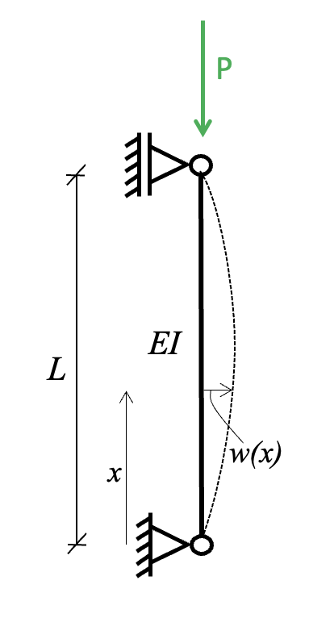
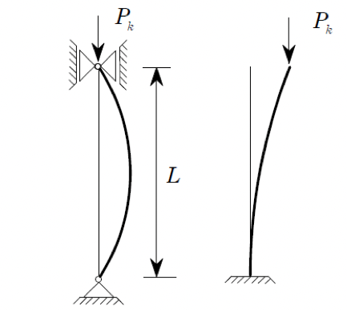

<!-- Generated by ipynb_to_quarto.py. Review before publication. -->
<!-- Source SHA-256: 2b82d2c6031a7d004c21a7e01f19627ea1832eb17536d50abc12deb96a808b73 -->

# Øving 2: Knekning


Her ser vi på et eksempel av andreordensligninger (med konstante koeffisienter) som er viktig i mekanikk.

## Den elastiske linjen og bjelkens ligning

Som dere skal se på i mekanikk, er moment relatert til forskyvningen $w(x)$ gjennom ligningen 

$$M = -EIw''(x).$$ 

Det kalles for ligningen for den elastiske linjen. Her er $EI$ bøyestivheten. Det kan kombineres med et kjent $M(x)$. Alternativt kan vi kombiner ligningen over med ligningen for moment fra en fordelt last og få 

$$w''''(x) = \frac{p}{EI},$$

hvor $p=-V'$ er den fordelte lasten. Den kalles for bjelkens ligning.

## Knekning



En klassisk problemstilling gjelder knekning av en søyle. Der har vi $M=Pw$, hvor $P$ er den normale kraften på søyla. Da får vi en ligning

$$
w'' + \frac{P}{EI} w = 0,
$$

Med ranbetingelsene $w(0)=w(L)=0$.

## Oppgave 1

1. Finn den generelle løsningen for ligningen over.
2. For hvilken verdier av $P$ får du en løsning som ikke er like null?
3. Den minste slik verdi kalles for Eulers knekklast. Finn den om $E=1000$ MPa, $I=56.25$ mm$^4$, og $L=31$cm.
4. Vi kan legge inn en avstivningssøtte slik at vi får en ekstra randbetingelse $w(L/2)=0$. Hvordan påvirker det knekklasten?

## Andre oppsetninger



Ellers kan vi ta andre bjelker i samme situasjon. For eksempel en fritt bjelke som den til høyre over gir

$$
w''' + \frac{P}{EI}w' = 0,
$$

Med tilsvarende randbetingelser $w'(0)=w(0)=0$, $w''(L)=0$. Legg merke til at hvis du setter $v(x) = w'(x)$, får du en andreordens ligning for $v(x)$.

## Oppgave 2

1. Finn en generell løsning for den andreordensligning for $v(x)$
2. Finn en generell løsning for $w(x)$ ved å integrere.
3. Hva blir knekklasten?

::: {.callout-warning title="Mulig kodeoppgave"}
Kodecelle 6 følger en oppgavetekst og kan vurderes for `py-exercise` eller en interaktiv Pyodide-celle.
:::

```{python}
#| label: cell-6
#| echo: true

```
