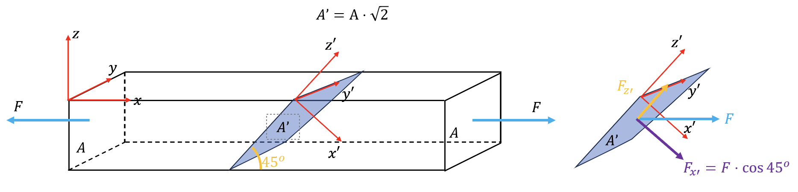
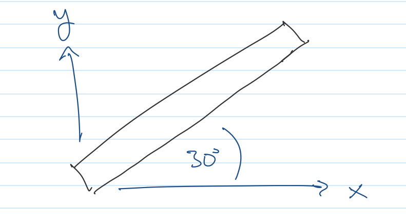

<!-- Generated by ipynb_to_quarto.py. Review before publication. -->
<!-- Source SHA-256: 08b8804f7624c67a5cc368640ac26f60c66a218b74f7c316a6476203a6afa542 -->

# Spenning og tøyning

## Lineære transformasjoner (tensorer) i mekanikk

Vi tar utgangspunkt i kapitel 9 (og i mindre grad 10-12) av Bell II. Da viser det seg at de fleste av mekanikkens størrelser, for eksempel treghetsmoment, andrearealmoment, spenning og tøyning er egentlig matriser. Eller mer presist, de er lineære transformasjoner, slik at om vi bytter koordinater, får vi $A_B = B^{-1} A B$, slik vi husker fra uke 4! Det er vanlig å bruke ordet tensor for matriser som skal representere lineære transformasjoner - det betyr at de er matriser som bytter koordinater på riktig måte.

## Spenning

Hva er egentlig spenning? Det er kraften (en vektor) som virker på et tversnitt med oppgitt normalvektor $\vec{n}$, dvs.

$$
\Phi(\vec{n}) = S \vec{n}.
$$

Hvor kom $S$ fra? Det viser seg at $\Phi(\vec{n})$ er en lineær transformasjon, og kan derfor assosieres (i enhver basis) med en matrise. Det har vi kalt for $S$.

Det er vanlig å dele opp $\Phi(\vec{n}) = \sigma \vec{n} + \vec{\tau}$, hvor $\sigma$ er $\textit{normalspenning}$ og $\vec{\tau}: \vec{\tau}\times\vec{n}=0$ er $\textit{skjærspenning}$.

## Last og spenning

Hvis bjelken utsettes for en aksial last $N$, vil normalspenning i bjelkens tverrsnitt være $\sigma_N = \frac{N}{A}$, hvor arealet av tversnittet er lik $A$.

Om vi har et moment $\vec{M} = (M_y, -M_z)$ i tillegg, har vi med visse forbehold $\sigma_M(\vec{x}) = \vec{x}^T I^{-1} \vec{M}$ hvor $\vec{x}=(y,z)$ er posisjon i tversnittet, og $I$ er andre arealmoment-tensoren.

## Oppgave 1



En bjelke med tversnittsareal $0,05$m$^2$ utsettes for en aksial last på $100$N. 

1. Beregn spenningstensor i den naturlige basis $(x,y,z)$.
2. Beregn da normalspenning i et tversnitt med vinkel $45^\circ$ mot $x$-aksen.
3. Beregn spenningstensor i en den nye basis $(x', y', z')$ som i tegningen.
4. Et vanlig flytningskriterie (Tresca-kriteriet) er at skjærspenning $\tau(\phi)$ i tversnitt med tversnitt med vinkel $\phi^\circ$ ikke skal overskride $\frac{1}{2}f_y$, hvor $f_y$ er et bestemt verdi $\textit{flytespenning}$. Gitt at maks skjærspenning er hvor $\phi=45^\circ$, finn ut om flytning inntrer materialet gitt at flytespenningen er $75$MPa.

::: {.callout-warning title="Mulig kodeoppgave"}
Kodecelle 3 følger en oppgavetekst og kan vurderes for `py-exercise` eller en interaktiv Pyodide-celle.
:::

```{python}
#| label: cell-3
#| echo: true

```

## Planspenning

Det er ofte ingen (eller nesten) ingen spenning utenfor et bestemt plan, la oss si $xy$-planet. Da har vi

$$
S = \begin{pmatrix}
\sigma_x & \tau & 0 \\
\tau & \sigma_y & 0 \\
0 & 0 & 0
\end{pmatrix}
$$

Vi kaller den $2\times 2$-matrisa (tensor)

$$
S_p = \begin{pmatrix}
\sigma_x & \tau \\
\tau & \sigma_y 
\end{pmatrix}
$$

for planspenning. Den følger samme basisbytte regel $S'_p = B^{-1} S_p B$ som før, hvor $B$ er en basisbytte i $xy$-planet

## Diagonalisering

Spenning er symmetrisk, og kan derfor diagonaliseres, dvs hvis $(\sigma_1, \sigma_2, \sigma_3)$ er egenverdiene til $S$ og $B = [\vec{v}_1, \vec{v}_2, \vec{v}_3]$ er en matrise med egenvektorene, så har vi

$$
S = B^{-1} 
\begin{pmatrix}
\sigma_1 & 0 & 0 \\
0 & \sigma_2 & 0 \\
0 & 0 & \sigma_3
\end{pmatrix}
B
$$

Vi kaller $\sigma_i$ for hovedspenningene. Det funker på det samme måte med planspenning.

## Oppgave 2



Anta at alt skjer i planet. Et stav som danner en vinkel med $30^\circ$ med $x$-aksen utsettes for følgende planspenning

$$
S_p = \begin{pmatrix}
75 & 26 \\
26 & 105
\end{pmatrix}
$$

1. Diagonaliser matrisa
2. Hva er egenbasisen? Kunne du ha gjette den ut fra geometrien?
3. Hva slags krefter tror du stavet er utsatt for?

::: {.callout-warning title="Mulig kodeoppgave"}
Kodecelle 7 følger en oppgavetekst og kan vurderes for `py-exercise` eller en interaktiv Pyodide-celle.
:::

```{python}
#| label: cell-7
#| echo: true

```
