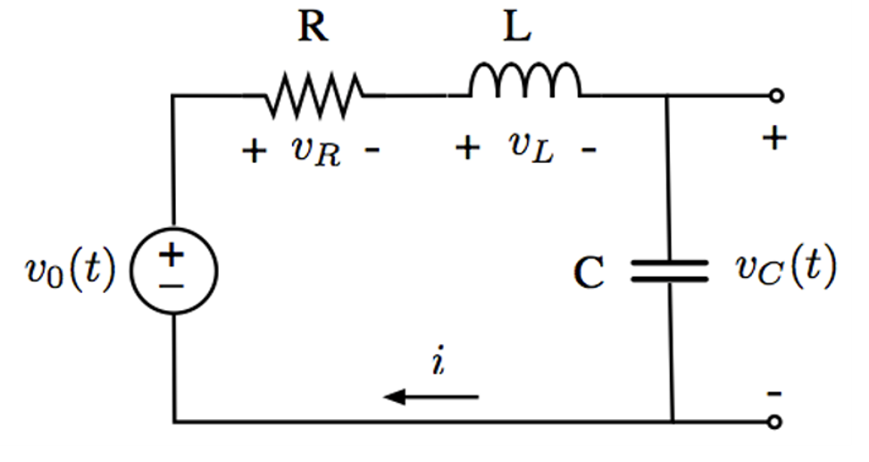

<!-- Generated by ipynb_to_quarto.py. Review before publication. -->
<!-- Source SHA-256: df1b888d12bd64a1a8f9c6eaf82db084f925a1b8a11eb15ee45414a43f8ade24 -->

# Oppgave 2: Transferfunksjon for RLC-krets

Figuren nedenfor viser en RLC-krets. Kretsen påtrykkes en variabel spenning med spenningskilden $v_0(t)$, og vi skal måle spenningen over kondensatoren $v_C(t)$.


RLC-kretser slik som dette brukes blant annet til å filtrere lydsignal, og separere ut f.eks. bass eller diskant.

* Forholdet mellom spenningen $v_0(t)$ fra spenningskilden og kondensatorspenningen $v_C(t)$ kan beskrives med en andreordens differensialligning:

$$ v_0(t) = LC \cdot \frac{d^2 v_C(t)}{dt^2} + RC\cdot \frac{d v_C(t)}{dt} + v_C(t)$$

* En svært nyttig egenskap for laplacetransformen er at derivasjon i tidsdomenet tilsvarer multiplikasjon med variabelen $s$ i lapalce-domenet:
$$\mathcal{L}\left(\frac{x(t)}{dt} \right) = s\cdot X(s), \ \ \ \text{ der } X(s) = \mathcal{L}(x(t) $$
Konsekvensen av dette er at vi ved hjelp av laplacetransformasjon kan omforme en differensialligning (vanskelig å løse) til en algebraisk ligning (forholdsvis enkel å løse).

***
### Oppgave a)

Vi definerer transferfunksjonen $H(s)$ til RLC-kretsen som $H(s) = \frac{V_C(s)}{V_0(s)}$. Finn uttrykket for $H(s)$ 
***
<br>
Videre i oppgaven går vi ut ifra at komponentene i kretsen har følgende verdier:

* $R = 10 \ \Omega$
* $L = 5 \ m H$
* $C = 50 \ \mu F$

***
### Oppgave b)

Transferfunksjoner for RLC-kretser skrives ofte som funksjon av *dempingsrate* $\zeta$, og *naturlig frekvens* $\omega_0$ som følger:

$$ H(s) = \frac{\omega_0^2}{s^2 + 2\zeta \omega_0 s + \omega_0^2}$$

hva blir dempingsraten $\zeta$ og den naturlige frekvensen $\omega_0$ til kretsen? Er systemet underdempet, kritisk dempet eller overdempet?
***

## Transferfunksjoner i Python

`scipy`-modulen til Python inneholder en egen funksjon [`scipy.signal.TransferFunction(num, den)`](https://docs.scipy.org/doc/scipy/reference/generated/scipy.signal.TransferFunction.html#scipy.signal.TransferFunction) for å lage egne transferfunksjon-objekter vi kan bruke til å *simulere* elektriske kretser. For at denne skal kunne etterligne riktig transferfunksjon, må vi gi den to arrays med koeffisientene til både telleren og nevneren i transferfunksjonen $H(s)$.

#### Eksempel:

* Transferfunksjon:
$$H(s) = \frac{s + 2}{s^2 + 6s + 9} = \frac{\mathbf{1}\cdot s + \mathbf{2}}{\mathbf{1} \cdot s^2 + \mathbf{6}\cdot s + \mathbf{9} } $$

* Konstruksjon av transferfunksjon i Python:
```Python
import scipy.signal as sig
numerator = [1, 2]
denominator = [1, 6, 9]
system = sig.TransferFunction(numerator, denominator)
```

***
### Oppgave c)
Bruk funksjonen [`step`](https://docs.scipy.org/doc/scipy/reference/generated/scipy.signal.step.html) i modulen `scipy.signal` til å regne ut sprangresponsen til RLC-kretsen, og bruk matplotlib til å tegne en graf av den naturlige responsen. Stemmer formen på sprangresponsen med dempingsraten du fant i deloppgave ***b)***?
***

::: {.callout-warning title="Mulig kodeoppgave"}
Kodecelle 6 følger en oppgavetekst og kan vurderes for `py-exercise` eller en interaktiv Pyodide-celle.
:::

```{python}
#| label: cell-6
#| echo: true

```
