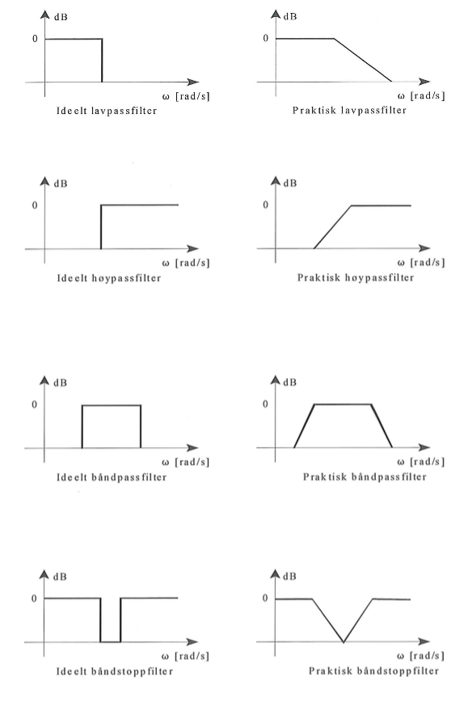
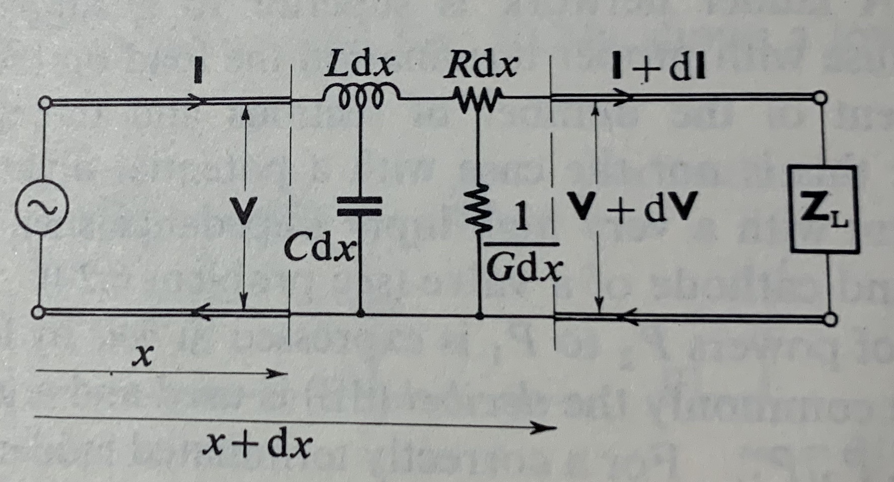

<!-- Generated by ipynb_to_quarto.py. Review before publication. -->
<!-- Source SHA-256: 971aa666f996cb464358adc2c0a3a41f12b4a1f06b93990e2c457e08f48fe503 -->

# Signalbehandling - Elektro

Har skal vi se på Laplacetransformasjon og anvendelser innenfor signalbehandling.

Det vil bli lagt ut noen øvinger som skal hjelpe med forståelse av Laplacetransformasjon. Disse er ikke obligatorisk, men anbefales da de vil hjelpe dere komme i gang med prosjektet.

## Oppgave 1: En differensialligning


La

$$
f(t) = 
\begin{cases}
 0 \quad & t< 0 \\
2t \quad & 0\leq t<1 \\
3-t \quad & 1\leq t < 2 \\
1 \quad & 2\leq t<4 \\
5-t \quad & 4\leq t<5 \\
0 \quad & t\geq 5
\end{cases}
$$

a) Tegn grafen til funksjonen $f$ på intervallet $[0,7]$.

b) Finn Laplacetransformasjon $F(s)$ av funksjonen $f$ og tegn grafen til funksjonen $F$ på intervallet $[0,7]$.

c) Løs differensialligningen:

$$
y'(t) + 2y(t) = f(t), \quad y(0^-)=0
$$

ved bruk av Laplacetransformasjon, og tegn grafen til funksjonen $y$ på intervallet $[0,7]$.

### Løsning
Grafene til funksjonene er samlet i koden under.

#### b)
Det er kanskje enklest å tegne kurven $y=f(t)$ for hånd først, da er det forholdsvis lett å uttrykke $f(t)$ med sprangfunksjoner, basert på stigningstallene til kurven. 

Vi får:
$$f(t)=2t\cdot u(t)-3(t-1)\cdot u(t-1)+(t-2)\cdot u(t-2) - (t-4)\cdot u(t-4) + (t-5)\cdot u(t-5).$$

Vi har $\mathscr{L}\{ t \}=\dfrac{1}{s^2}$, som kombinert med 2.skiftteorem gir:


$$F(s)=\dfrac{2}{s^2}-\dfrac{3}{s^2}e^{-s} +  \dfrac{1}{s^2}e^{-2s}-  \dfrac{1}{s^2}e^{-4s}+  \dfrac{1}{s^2}e^{-5s}
\quad = \quad \dfrac{2-3e^{-s}+e^{-2s}-e^{-4s}+e^{-5s}}{s^2}.$$

Enda enklere blir det hvis vi deriverer funksjonen først. Siden kurven ikke har noen diskontinuiteter, får vi:
$$
f'(t) = 
\begin{cases}
2 \quad & 0< t<1 \\
-1 \quad & 1< t < 2 \\
0 \quad & 2< t<4 \\
-1 \quad & 4< t<5 \\
0 \quad & t> 5
\end{cases} 
\quad = \quad 2\big(u(t)-u(t-1)\big) - \big(u(t-1)-u(t-2)\big)-\big(u(t-4)-u(t-5)\big)
$$
som vi kan reskrive som
$$
f'(t)= 2u(t)-3u(t-1)+u(t-2)-u(t-4)+u(t-5)
$$

Laplacetransformert:
$$
sF(s)=\dfrac{2}{s}-\dfrac{3}{s}e^{-s}+\dfrac{1}{s}e^{-2s}-\dfrac{1}{s}e^{-4s}+\dfrac{1}{s}e^{-5s}
\quad \Rightarrow \quad
F(s) = \dfrac{2-3e^{-s}+e^{-2s}-e^{-4s}+e^{-5s}}{s^2}
$$

#### c)
$$
y'+2y=f(t)  
\quad \Rightarrow \quad 
(s+2)Y(s)=F(s) 
\quad \Rightarrow \quad 
Y(s)=\dfrac{2-3e^{-s}+e^{-2s}-e^{-4s}+e^{-5s}}{s^2(s+2)}
$$

Hvor:  
$$
G(s)=\dfrac{1}{s^2(s+2)}=\dfrac{A}{s}+\dfrac{B}{s^2}+\dfrac{C}{s+2} 
\quad \Rightarrow \quad 
As(s+2)+B(s+2)+Cs^2=1
\quad \Rightarrow \quad 
A = -\dfrac{1}{4} , B = \dfrac{1}{2}, C= \dfrac{1}{4}
$$

Dvs:
$$
g(t)=\mathscr{L}{^{-1}}\Big\{ \dfrac{1}{s^2(s+2)} \Big\} = -\dfrac{1}{4}+\dfrac{1}{2}t + \dfrac{1}{4}e^{-2t}
$$

Vi bruker 2.skiftteorem på nytt, og får:

$$
y(t)=2 g(t)- 3 g(t-1)\cdot u(t-1) + g(t-2)\cdot u(t-2)- g(t-4)\cdot u(t-4) + g(t-5)\cdot u(t-5)
$$

```{python}
#| label: cell-6
#| echo: true
import numpy as np
import matplotlib.pyplot as plt


def u(d):
    step = np.heaviside(t-d,1)     #  forsinket enhetssprang, u(t-d)
    return step

def g(d):
    func = -1/4 + 1/2*(t-d) + 1/4*np.exp(-2*(t-d))   # delrespons, g(t-d)
    return func

def e(d):                 
    eksp = np.exp(s*d)
    return eksp


t = np.linspace(0,7)
f = 2*t*u(0) - 3*(t-1)*u(1) + (t-2)*u(2) - (t-4)*u(4) +  (t-5)*u(5)  # Pådrag
y = 2*g(0)*u(0) - 3*g(1)*u(1) + g(2)*u(2) - g(4)*u(4) + g(5)*u(5)    # Respons


s = np.linspace(0.2,7)
F = (2-3*e(-1)+e(-2)-e(-4)+e(-5))/(s**2)  # Laplace av pådraget
Y = F/(s+2)                               # Laplace av responsen


fig, (ax1, ax2) = plt.subplots(1, 2, figsize=(16,6))

ax1.plot(t, f,label='pådrag, f(t)')
ax1.plot(t, y,label='respons, y(t)')
ax1.set(xlabel="$t$ (sek)")
ax1.legend()
ax1.grid()

ax2.plot(s, F,label='laplace av pådrag, F(s)')
ax2.plot(s, Y,label='laplace av respons, Y(s)')
ax2.set(xlabel="s")
ax2.legend()
ax2.grid()
```

## Oppgave 2: Seriekoblet RLC krets

Husk at en seriekoblet RLC-krets følger følgende differensialligning:

$$
\begin{pmatrix}
u'(t) \\
i'(t)
\end{pmatrix}
=
\begin{pmatrix}
-\frac{R}{L} & -\frac{1}{LC} \\
1 & 0
\end{pmatrix}
\begin{pmatrix}
u(t) \\
i(t)
\end{pmatrix}
+
\begin{pmatrix}
\frac{1}{L} v_s'(t) \\
0
\end{pmatrix}
$$

Hvor $i(t)$ er strømmen og $u(t)=i'(t)$ og $v_s(t)$ er spenningen. 

Løs ligningen med Laplace transformasjonen hvor $u(0)=i(0)=0$ (du kan velge passende konstante verdier til $R>0$, $L>0$, og $C>0$). Målet er å finne et utrykk for $i(t)$ som invers laplacetransformasjonen av et utrykk ikke avhengig av $i(t)$.

### Løsning

#### Metode 1
For å finne $I(s)$ ville det vært mye enklere å sette opp spenningsbalansen, og laplacetransformere denne:

$$
v_s(t) = u_R(t) + u_L(t) + u_c(t) = \displaystyle Ri(t)+L\frac{di}{dt}(t)+\frac{1}{C}\int_0^t i(s)\,ds.
$$

Som hvis vi antar null initialbetingelser gir transformert:
$$
V_s(s) = \displaystyle RI(s)+sLI(s)+\frac{1}{sC}I(s) 
\quad \Rightarrow \quad 
I(s) =\dfrac{\dfrac{s}{L}V_s}{s^2 + \dfrac{R}{L}s+\dfrac{1}{LC}}.
$$

#### Metode 2

Om vi skal følge oppgaveteksten, får vi ved direkte laplacetransformasjon:
$$
\begin{pmatrix}
sJ(s) \\
sI(s)
\end{pmatrix}
=
\begin{pmatrix}
-\frac{R}{L} & -\frac{1}{LC} \\
1 & 0
\end{pmatrix}
\begin{pmatrix}
J(s) \\
I(s)
\end{pmatrix}
+
\begin{pmatrix}
\frac{s}{L} V_s(s) \\
0
\end{pmatrix}
\quad \Rightarrow \quad 
\begin{pmatrix}
s+\frac{R}{L} & \frac{1}{LC} \\
-1 & s
\end{pmatrix}
\begin{pmatrix}
J(s) \\
I(s)
\end{pmatrix}
=
\begin{pmatrix}
\frac{1}{sL} V_s(s) \\
0
\end{pmatrix}.
$$


Vi inverterer matrisen. og får:

$$
\begin{pmatrix}
J(s) \\
I(s)
\end{pmatrix}=
\frac{1}{s^2+\frac{R}{L}s+\frac{1}{LC}}
\begin{pmatrix}
s & -\frac{1}{LC} \\
1 & s+\frac{R}{L}
\end{pmatrix}
\begin{pmatrix}
\frac{1}{sL} V_s(s) \\
0
\end{pmatrix}
\quad \Rightarrow \quad 
I(s) =\dfrac{\dfrac{s}{L}V_s}{s^2 + \dfrac{R}{L}s+\dfrac{1}{LC}} \quad ,\quad J(s)=sI(s)
$$

Dermed er 
$$i(t) =\mathcal{L}^{-1}\left(\dfrac{\dfrac{s}{L}V_s}{s^2 + \dfrac{R}{L}s+\dfrac{1}{LC}}\right)(t) $$

## Oppgave 3: Filtrering:

Her finnes et diagram over ideelle og praktiske filter:



Hvordan skal vi få dette til? Vi prøver med en av disse kretser:


Oppgaven din er altså å velge tre av filtrene. Deretter skal du for hvert av de tre valgte filtrenen:

a) Finne sprangresponsen.

b) Finne frekvensresponen.

c) Velg passende verdier til $R,L,C$ og tegn Bode-plottet i kodefeltet under.


Hvor nært den ideelle varianten av filtrene klarer du å nå?

## Løsning
### Jamfør figurene i oppgaveteksten

### 2.ordens lavpassfilter

Parallellkopling: $Z_p = \dfrac{\frac{1}{sC}\cdot R}{\frac{1}{sC}+R}= \dfrac{R}{RCs+1}$

Transferfunksjon for filteret:  $H(s)=\dfrac{Y(s)}{X(s)}=\dfrac{Z_p}{sL+Z_p}= \dfrac{\frac{1}{LC}}{s^2+\frac{1}{RC}s+\frac{1}{LC}}$

Vi velger gjerne like knekkfrekvenser  $\; \omega_{k1}=\omega_{k2}= \omega_k$

Det leder til at vi må ha $\; H(s)= \dfrac{\frac{1}{LC}}{s^2+\frac{1}{RC}s+\frac{1}{LC}}= \dfrac{\frac{1}{LC}}{(s+\omega_k)^2}= \dfrac{\frac{1}{LC}}{s^2+2\omega_k s +\omega_k^2}$

Når vi har valgt $\omega_k$ og én av parameterne $R$, $L$ eller $C$, kan vi beregne de øvrige parameterne. 


### 2.ordens høypassfilter

Parallellkopling: $Z_p = \dfrac{sL\cdot R}{sL+R}$

Transferfunksjon for filteret:  $H(s)=\dfrac{Y(s)}{X(s)}=\dfrac{Z_p}{\frac{1}{sC}+Z_p}= \dfrac{s^2}{s^2+\frac{1}{RC}s+\frac{1}{LC}}$

Med like knekkfrekvenser  $\; \omega_{k1}=\omega_{k2}= \omega_k$ leder det til:

$$
H(s)= \dfrac{s^2}{s^2+\frac{1}{RC}s+\frac{1}{LC}}= \dfrac{s^2}{(s+\omega_k)^2}= \dfrac{s^2}{s^2+2\omega_k s +\omega_k^2}
$$


### Høypassfilter
Transferfunksjon for filteret:  $H(s)=\dfrac{Y(s)}{X(s)}=\dfrac{R}{R+sL+\frac{1}{sC}}= \dfrac{\frac{R}{L}s}{s^2+\frac{1}{RC}s+\frac{1}{LC}}$

Her må vi velge to ulike knekkfrekvenser $\; \omega_{k1}\neq \omega_{k2}$, som leder til:
$$
H(s)=\dfrac{\frac{R}{L}s}{s^2+\frac{1}{RC}s+\frac{1}{LC}}
= \dfrac{\frac{R}{L}s}{(s+\omega_{k1})(s+\omega_{k2})}
= \dfrac{\frac{R}{L}s}{s^2+(\omega_{k1}+\omega_{k2})s+\omega_{k1}\omega_{k2}}
$$

### Båndstoppfilter
Parallellkopling: $Z_p = \dfrac{sL\cdot \frac{1}{sC}}{sL+\frac{1}{sC}} = \dfrac{sL}{LCs^2+1}$

Transferfunksjon for filteret:  $H(s)=\dfrac{Y(s)}{X(s)}=\dfrac{R}{R + Z_p}= \dfrac{s^2+\frac{1}{LC}}{s^2+\frac{1}{RC}s+\frac{1}{LC}}$

Vi velger to ulike knekkfrekvenser $\; \omega_{k1}\neq \omega_{k2}$, slik at:

$$
H(s)= \dfrac{s^2+\frac{1}{LC}}{s^2+\frac{1}{RC}s+\frac{1}{LC}}
= \dfrac{s^2+\frac{1}{LC}}{(s+\omega_{k1})(s+\omega_{k2})}
= \dfrac{s^2+\frac{1}{LC}}{s^2+(\omega_{k1}+\omega_{k2})s+\omega_{k1}\omega_{k2}}
$$


### Talleksempel med lavpassfilteret
Vi velger $\omega_k=1000$ (rad/s) og $R=4\,\Omega$ 

Da må vi ha (sammenlikner nevnerne i H(s)) at: $\, s^2+\frac{1}{RC}s+\frac{1}{LC}=s^2+2000s +1000^2$ ,
som gir:

$$
  \begin{cases}
    {1\over{RC}}=2000 \\[0.3em]
    {1\over{LC}}=10^6 
  \end{cases}
  \quad \Rightarrow \quad 
  \begin{cases}
    C = {1\over{4\cdot 2000}}={1\over 8000}=125\, \mu F \\[0.3em]
    L={1\over{C\cdot 10^6}}= {1\over 125}=8\, mH
  \end{cases}
$$

Transferfunksjon for filteret:  $H(s)=\dfrac{1e6}{s^2+2000s+1e6}$

Under følger alternative kodinger for bodeplot.

```{python}
#| label: cell-13
#| echo: true
# Bodeplot for lavpassfilteret. Alternativ 1

from pylab import *
from scipy import signal
import matplotlib.pyplot as plt

sys = signal.TransferFunction(1e6, [1, 2000, 1e6])
w = logspace(1,5) 
w, mag, phase = signal.bode(sys,w)

fig,(ax1,ax2)=plt.subplots(1, 2, figsize=(10,4))

ax1.semilogx(w, mag)    # Bode magnitude plot
ax1.grid()
ax1.set(xlabel='$\omega\,$(rad/s)')
ax1.set(ylabel='dB')
ax1.set(title='Forsterkning i dB')

ax2.semilogx(w, phase)  # Bode phase plot
ax2.grid()
ax2.set(xlabel='$\omega\,$(rad/s)')
ax2.set(ylabel='degrees')
ax2.set(title='Faseforskyvning i grader')
```

```{python}
#| label: cell-14
#| echo: true
# Bodeplot for lavpassfilteret. Alternativ 2

import numpy as np
import matplotlib.pyplot as plt

                 
omega = np.arange(10, 1e5, 0.1)     # Frekvensintervall [10,100000] rad/s
s = omega*1j                       # Bytter ut s med jw

H = 1e6/((s + 1000)**2)        # Transferfunksjon for filteret

magn = abs(H)                  # Absolutt forsterkning
magn_dB = 20*np.log10(magn)    # Forsterkning i dB
arg = np.angle(H)
phase = np.rad2deg(arg)        # Faseforskyvning i grader

fig, (ax1, ax2, ax3) = plt.subplots(1, 3, figsize=(12,4))

ax1.semilogx(omega, magn)      # Bruker logaritmisk skala på frekvens-aksen
ax1.set(title='Absolutt forsterkning')
ax1.grid()

ax2.semilogx(omega, magn_dB)
ax2.set(title='Forsterkningen i dB')
ax2.grid()

ax3.semilogx(omega, phase)
ax3.set(title='Faseforskyvning (grader)')
ax3.set(xlabel="$\omega$ (rad/s)")
ax3.grid()
```

## Oppgave 4: Telegrafistligning

#### Motivasjon for telegrafistligningen.
Dette er ikke så viktig for å løse ligningen, men en kort forklaring på hvor ligningen kommer fra. Dere vil mest sansynlig til å se denne ligningen i senere fag, så vi kommer ikke til å utlede likningen. For de som er interessert kan utledningen finnes her: https://www.youtube.com/watch?v=qFBr9xXloAc.

Som regel når vi arbeidar med kretser antar vi at potensialet $v$ forandre seg momentant igjennom kretsen når vi gjør endringer. For eksempel om vi sender et elektrisk strømsignal igjennom en internettkabel, antar vi at signalet blir mottatt i andre enden momentant. Samtidig ser vi vekk ifra resistansen, kapasiteten og induktansen til selve kabelen. 

Dette medfører at om $v(x, t)$ er spenningen i punktet $x$ i kabelen ved tiden $t$, har vi at $$v(0,t)=v(x_1,t),\quad v(L,t)=v(x_2,t).$$
Fra Ohm's lov vet vi at
$$i(x,t)=\frac{v(L, t)-v(0,t)}{R},$$
og er dermed uavhengig av posisjon.

Dette er kanskje en grei forenkling når lengden $L$ er liten. Derimot over lange avstander, som over atlanteren, vil ikke denne forenklingen fungere. Siden kabelen da er lang, vil for eksempel resistansen ha mer å si for hvordan spenningen forandrer seg igjennom kabelen samtidig som forandringen i spenning trenger tid for å bevege seg igjennom kabelen, siden den ikke kan gå over lysest hastighet.

## Alternativt bilde




Om vi derimot om vi ønsker en mer realistisk likning for å beskrive dette tilfellet, må vi ta med forskjellige egenskaper til kabelen. La oss si at kabelen har følgende egenskapar:
* resistansen per lengde $R$ for kabelen målt i for eksempel $\mathrm{\Omega/km}$,
* kapasiteten per lengde $C$ for kabelen målt i for eksempel $\mathrm{nF/km}$,
* induktansen per lengde $L$ for kabelen målt i for eksempel $\mathrm{\mu H/km}$, og
* konduktivitet per lengde $G$ for kabelen målt i for eksempel $\mathrm{\mu S/km}$.

For oss er det ikke så viktig hva som er den fysiske betydingen til konstantene $R,\, C,\, L$ og $G$, det eneste som er viktig er at de er fikserte konstanter.

I punktet $x$ og ved tiden $t$ har vi at spenningen og strømmen oppfyller telegraflikningen
$$
\begin{cases}
v_x(x,t) = -Li_t(x,t)  - Ri(x,t),\\
i_x(x,t) = -Cv_t(x,t) -G v(x,t) .
\end{cases}$$

### a)
Vis at ligningen kan skrives på formen

$$
\vec{u}_x(x,t)= A\vec{u}_t(x,t)+B\vec{u}(x,t)
$$

hvor $$\vec{u}(x,t)=\begin{pmatrix}v(x,t)\\ i(x,t)\end{pmatrix}$$ og $A$ og $B$ er matriser.


### b)
La 

$$
F(x,s)=\mathcal{L}_t(f)(x,s)=\int_0^\infty f(x,t) e^{-st}\mathrm{d}t
$$

være laplacetransformen i tidsvariabelen. Noter 

$$
\vec{U}(x,s)=\begin{pmatrix}\mathcal{L}_t(v)(x,s)\\ \mathcal{L}_t(i)(x,s)\end{pmatrix}=\begin{pmatrix}V(x,s)\\ I(x,s)\end{pmatrix}.
$$

Finn laplacetransformen av ligningen i oppgave 4a hvor vi antar at $\vec{u}(x,0)=0$.

### Harmonisk respons

Ut i fra svaret på b) skal dere ha kommet fram til et uttrykk på formen 
$$
\frac{\partial}{\partial x}
\begin{pmatrix}
V(x,s) \\ I(x,s)
\end{pmatrix}
=
M(s)
\begin{pmatrix}
V(x,s) \\ I(x,s)
\end{pmatrix},
$$ hvor M er en (2 x 2)-matrise.

La strøm og spenning i avsenderenden være sinusvarierende med frekvens $\omega$, dvs. $v(0,t)=A\sin(\omega t)$ og $i(0,t)=B\sin(\omega t)$. Vi ser bare på **stasjonære forhold** $ (t\rightarrow \infty)$.  

Da kan vi sette $s=j\omega$, og samtidig representere strøm og spenning som visere (vektorer).

Likningen endres da til
$$
\frac{\partial}{\partial x}
\begin{pmatrix}
\mathbf{V}(x,\omega) \\ \mathbf{I}(x,\omega)
\end{pmatrix}
=
M(j\omega)
\begin{pmatrix}
\mathbf{V}(x,\omega) \\ \mathbf{I}(x,\omega)
\end{pmatrix},
$$
hvor 
$$\begin{pmatrix}
\mathbf{V}(x,\omega) \\ \mathbf{I}(x,\omega)
\end{pmatrix}=\begin{pmatrix}
V(x,j\omega) \\ I(x,j\omega)
\end{pmatrix}.$$

Dette kan betraktes som et system av homogene 1.ordens ODE'er med hensyn på $x$.

### c)

Finn den generelle løsningen av likningssettet ved hjelp av egenverdiene og egenvektorene til matrisen $M(j\omega)$.

For at svaret skal bli litt ryddigere kan dere sette $Z = R+j\omega L $ (**serieimpedans** pr. km) og
$Y = G+j\omega C $ (**shuntadmittans** pr. km).

Deretter kan vi innføre $\gamma = \sqrt{YZ} \,$ (**forplantningskonstant**) og 
$Z_c = \sqrt{\dfrac{Z}{Y}} \,$ (**karakteristisk impedans**).


### d)

Finn den stasjonære løsningen innsatt initialbetingelsene  $\, 
\vec{\mathbf{U}}(0,\omega)= 
\begin{pmatrix}
\mathbf{V}_s\\
\mathbf{I}_s
\end{pmatrix}.
$

### Løsning
#### a)
På matriseform:
$$
\dfrac{\partial}{\partial x}
\begin{pmatrix}
V(x,t) \\
I(x,t)
\end{pmatrix}
=
\begin{pmatrix}
0 & -L \\
-C & 0
\end{pmatrix}
\cdot \dfrac{\partial}{\partial t}
\begin{pmatrix}
V(x,t)\\
I(x,t)
\end{pmatrix}
+
\begin{pmatrix}
0 & -R\\
-G& 0
\end{pmatrix}
\begin{pmatrix}
V(x,t)\\
I(x,t)
\end{pmatrix}.
$$

Symbolsk:
$$
\vec{u}_x(x,t) = A\,\vec{u}_t(x,t) + B\,\vec{u}(x,t).
$$

#### b)
Ved å sette initialbetingelsene $\vec{u}(x,0)=\vec{0}$ , får vi ved laplacetransformasjon (i tid) at:

$$
\mathcal{L}_t\big\{ \vec{u}(x,t) \big\}= \vec{U}(x,s)
\quad  \text{ og } \quad 
\mathcal{L}_t\Big\{\dfrac{\partial}{\partial t} \vec{u}(x,t) \Big\}= s\vec{U}(x,s)
$$ 

Det gir oss:
$$
\dfrac{\partial}{\partial x}
\begin{pmatrix}
V(x,s) \\
I(x,s)
\end{pmatrix}
=
\begin{pmatrix}
0 & -sL-R \\
-sC-G & 0
\end{pmatrix}
\begin{pmatrix}
V(x,s)\\
I(x,s)
\end{pmatrix}.
$$

### Stasjonære forhold:

#### c)
Dersom vi bare ser på stasjonære forhold $(t\rightarrow \infty)$, kan vi sette $s=j\omega$.

( Det tilsvarer at vi fjerner tid som en parameter, slik at likningen bar vil avhenge av lengde, $x$. )

Vi får da
$$
\dfrac{\partial}{\partial x}
\begin{pmatrix}
\mathbf{V}(x,\omega) \\
\mathbf{I}(x,\omega)
\end{pmatrix}
=
\begin{pmatrix}
0 & -j\omega L-R \\
-j\omega C-G & 0
\end{pmatrix}
\begin{pmatrix}
\mathbf{V}(x,\omega)\\
\mathbf{I}(x,\omega)
\end{pmatrix}
= 
\begin{pmatrix}
0 & -Z \\
-Y & 0
\end{pmatrix}
\begin{pmatrix}
\mathbf{V}(x,\omega)\\
\mathbf{I}(x,\omega)
\end{pmatrix}
$$

hvor:   $Z = R + j\omega L \,$ (serieimpedans) og  $Y = G+ j\omega C\,$ (shuntadmittans)


For å løse dette likningssettet (mhp. x), kan vi bruke det vi lærte i Matte 1 med egenverdier og egenvektorer.

La 
$M = \begin{pmatrix}
0 & -Z \\
-Y & 0
\end{pmatrix}$

Da kan vi finne egenverdiene:  
$$
\det(\lambda I - M)=0 
\quad\Rightarrow\quad 
\begin{vmatrix}
\lambda & Z \\
Y & \lambda
\end{vmatrix}
= \lambda^2-YZ = 0
\quad\Rightarrow\quad 
\lambda = \pm \sqrt{YZ}
$$


Innsatt $\lambda_1 = \sqrt{YZ} \,$ får vi egenvektoren:

$$
(\lambda I_1 - M)\vec{p}_1 = \vec{0} 
\quad\Rightarrow\quad 
\begin{pmatrix}
\sqrt{YZ} & Z \\
Y & \sqrt{YZ}
\end{pmatrix}\vec{p}_1 = \vec{0}
\quad\Rightarrow\quad 
\vec{p}_1 =
\begin{pmatrix}
-Z \\
\sqrt{YZ}
\end{pmatrix}
=
-Z \cdot \begin{pmatrix}
1 \\
-\sqrt{\dfrac{Y}{Z}}
\end{pmatrix}
$$

Tilsvarendet med $\lambda_2 = \sqrt{YZ}  \quad\Rightarrow\quad   \vec{p}_2 =  Z \cdot 
\begin{pmatrix}
1 \\
\sqrt{\dfrac{Y}{Z}}
\end{pmatrix}$

Vi innførerer størrelsene $\textbf{forplantningskonstant} \text{ (propagation constant)}, \gamma = \sqrt{YZ}\,$ (altså samme absoluttverdi som egenverdiene) 
og $\textbf{karakteristisk impedans , } Z_c=\sqrt{\dfrac{Z}{Y}}$ 


Siden liknigsettet vårt er homogent
$$
\dfrac{\partial}{\partial x}
\begin{pmatrix}
\mathbf{V}(x,\omega) \\
\mathbf{I}(x,\omega)
\end{pmatrix}
=
M
\begin{pmatrix}
\mathbf{V}(x,\omega)\\
\mathbf{I}(x,\omega)
\end{pmatrix}
$$

Vil løsningsmengden være

$$
\vec{\mathbf{V}}(x,\omega)= k_1 \vec{p}_1 e^{\lambda_1 x} + k_2 \vec{p}_2 e^{\lambda_2 x}
\quad\Rightarrow\quad 
\begin{pmatrix}
\mathbf{V}(x,\omega) \\
\mathbf{I}(x,\omega)
\end{pmatrix}
=
k_1 \begin{pmatrix}
1 \\
-\dfrac{1}{Z_c}
\end{pmatrix} e^{\gamma x}
+
k_2 \begin{pmatrix}
1 \\
\dfrac{1}{Z_c}
\end{pmatrix} e^{-\gamma x}
$$

#### d)

Vi velger initialbetingelsene  
$$
\vec{\mathbf{V}}(0,\omega)= 
\begin{pmatrix}
\mathbf{V}_s\\
\mathbf{I}_s
\end{pmatrix}
$$
Dvs. spenning og strøm i avsenderenden, hvor $\mathbf{V}_s \,$ og $\,\mathbf{I}_s \,$ er sinusstørrelser (med vinkelfrekvens $\omega \,$) , representert som visere.


Vi får da:
$$
\mathbf{V}(0,\omega) = \mathbf{V}_s = k_1 + k_2  
\quad\text{ og }\quad
\mathbf{I}(0,\omega) = \mathbf{I}_s = -\dfrac{k_1}{Z_c} + \dfrac{k_2}{Z_c} 
$$

Som løst simultant gir
$$
k_1 = \dfrac{V_s - Z_cI_s}{2} \quad \text{og} \quad k_2 = \dfrac{V_s + Z_cI_s}{2} 
$$

Da får vi løsningene:
$$
\mathbf{V}(x,\omega) = \dfrac{\mathbf{V}_s-Z_c\mathbf{I}_s}{2} \, e^{\gamma x}
+ \dfrac{\mathbf{V}_s+Z_c\mathbf{I}_s}{2} \, e^{-\gamma x}
$$

$$
\mathbf{I}(x,\omega) = \dfrac{\mathbf{I}_s - \dfrac{\mathbf{V}_s}{Z_c}}{2} \, e^{\gamma x}
+ \dfrac{\mathbf{I}_s + \dfrac{\mathbf{V}_s}{Z_c}}{2} \, e^{-\gamma x}
$$

#### Hyperbolsk form
Svaret ser mye penere ut om vi innfører $\quad \cosh(\gamma x)=\dfrac{e^{\gamma x}+e^{-\gamma x}}{2} \quad$ og 
$\quad \sinh(\gamma x)=\dfrac{e^{\gamma x}-e^{-\gamma x}}{2}$

Løsninger:
$$
\mathbf{V}(x,\omega) = \mathbf{V}_s  \cosh(\gamma x) - Z_c \mathbf{I}_s \sinh(\gamma x)
$$

$$
\mathbf{I}(x,\omega) = \mathbf{I}_s  \cosh(\gamma x) - \dfrac{\mathbf{V}_s}{Z_c}\, \sinh(\gamma x)
$$

```{python}
#| label: cell-22
#| echo: true

```

## Oppgave 5: (Uke 16) Å sende et signal

Anta at vi vil sende en signal $v(0,t)=g(t)$ ned en linje til en mottaker.

Det vi sender vil ta formen $v(x,t)$, som i telegrafist-eksempel ovenfor. Hvis funksjonen har i tillegg formen

$$
v(x,t) = g(x+ct)
$$

Vil signalet bli sendt ned linjen, uten tap av styrken til signalet (se under).

::: {.callout-warning title="Mulig kodeoppgave"}
Kodecelle 24 følger en oppgavetekst og kan vurderes for `py-exercise` eller en interaktiv Pyodide-celle.
:::

```{python}
#| label: cell-24
#| echo: true
import matplotlib.animation as animation
import matplotlib.pyplot as plt
import numpy as np

fig, ax = plt.subplots()

x = np.arange(0, 2*np.pi, 0.01)
line, = ax.plot(x, np.sin(x))


def animate(i):
    line.set_ydata(np.sin(x - i / 10))  # update the data.
    return line,


ani = animation.FuncAnimation(
    fig, animate, interval=20, blit=True, save_count=50)

from IPython.display import HTML
HTML(ani.to_jshtml())
```

Men livet er ikke alltid så lett. Vi viser her et diskret eksempel hvor vi ender opp med tap på linjen.

Begynn med

$$
u(x_i, 0) = g(x_i), \quad -1\leq x<1, \quad \vec{x}=(-1,-0.9,\ldots,1)
$$

og legg til *periodiske randbetingelser* $u(0, t)=u(1, t)$ for alle tider $t$. Vi kommer til å sette tidene lik $t_0=0,t_1=0.1,\ldots,t_{10}=1$.

I eksempel over løser man ligningen

$$
v(x_i, t_{n+1}) = v(x_{i-1},t_n), \quad n=0,\ldots 9
$$
og ender opp med en ren forflyttning av av signalet.

I denne oppgaven skal vi derimot se på ligningen

$$
u(x_i, t_{n+1}) = \frac{3}{8} u(x_{i-1}, t_n) + \frac{3}{4} u(x_i, t_n) - \frac{1}{8} u(x_{i+1}, t_n), \quad n=0,\ldots 9
$$


### a)

Plott utviklingen av funksjonen når $g(x) = 1 - U(x)$ er en trappefunksjon ($U(x)$ er den vanlige Heaviside funksjon), for $t=t_0, \ldots, t_{10}$.

### b)

Kommenter resultatet. Hva skjer med $u$ når tiden går?

### c)

La $\vec{u}(t_n) = \big( u(x_0, t_n), u(x_1, t_n), \ldots \big)$, og $\vec{v}$ tilsvarende.

Legg merke til at transformasjonene $\vec{u}(t_n) \mapsto \vec{u}(t_{n+1})$  og $\vec{v}(t_n) \mapsto \vec{v}(t_{n+1})$ er lineære transformasjoner, dvs kan skrives som $\vec{u}(t_{n+1}) = L_u \vec{u}(t_n)$ og $\vec{v}(t_{n+1}) = L_v \vec{u}(t_n)$ for matriser $L_u, L_v$.

Finn matrisene $L_u$ og $L_v$, for en vilkårlig $n$ mellom 0 og 10 (matrisene er ikke avhengig av $n$).

### d)

Den diskrete Fouriertransformasjon $\vec{u}\mapsto \vec{U}$ er en lineær avbildning, som kan representeres med en matrise:

$$
\vec{U} = A \vec{u}
$$

Siden den er inverterbar kan det tolkes som en basisbytte. Husk fra matematikk 1 at en lineær avbildning $\vec{u} \mapsto L \vec{u}$ kan skrives i den nye basisen gitt av $A$ med

$$
\tilde{L} = A^{-1} L A
$$

Ta den diskrete Fouriertransformasjon av transformasjonene $\vec{u}(t_n) \mapsto \vec{u}(t_{n+1})$  og $\vec{v}(t_n) \mapsto \vec{v}(t_{n+1})$.

Altså, finn de to matrisene $\tilde{L}_u$ og $\tilde{L}_v$ tilsvarende disse transformasjonene i Fourierbasisen.

### e)

Kommenter resultatene. Kan du forklarer det du fant i oppgave b? 

*Hint: matrisene vil inneholde komplekse tall. Se på argumentet til diagonalelementene. Du burde se et tidlig mønster i $\tilde{L}_v$, som savnes i $\tilde{L}_u$*

## Løsning

### a)

Se under

```{python}
#| label: cell-27
#| echo: true
# koden for U på bildet her
```

### b)

Vi ser forderving av signalet.

### c)

se under

```{python}
#| label: cell-30
#| echo: true
import scipy.sparse as sp

m=21
n=10

x = np.linspace(-1,1,m)
t = np.linspace(0,1,n)

U = sp.diags([3/8,3/4,-1/8],[-1,0,1],shape=(m,m))


V = sp.diags([1],[-1],shape=(m,m))

U = U.toarray()
V = V.toarray()

# periodiske randbetingelser
U[0,-1] = 3/8
U[-1,0] = -1/8

# periodiske randbetingelser
V[0,-1] = 1
```

```{python}
#| label: cell-31
#| echo: true
print(U)
```

```{python}
#| label: cell-32
#| echo: true
print(V)
```

### d)

Matrisene finnes sånn:

```{python}
#| label: cell-34
#| echo: true
U1 = np.fft.fft(U,axis=0)

U2 = np.fft.ifft(U1,axis=1)

V1 = np.fft.fft(V,axis=0)

V2 = np.fft.ifft(V1,axis=1)
```

### e)

Vi ser at argumentet til diagonalelementene til forflytting er en rett linje (opptil en sprang som skyldes valg av branch cut i argumentet)

Det savner vi i u

```{python}
#| label: cell-36
#| echo: true
# argumentet til diagonalelementene
U3 = np.angle(np.diagonal(U2))

V3 = np.angle(np.diagonal(V2))


# absolutt verdier - kan sjekke at matrisen er (tilnærmet) diagonalmatriser
U4 = np.abs(U2)

V4 = np.abs(V2)

# plotter argumentene

# u i blå
plt.plot(x,U3)

#v i oransje
plt.plot(x,V3)
```

## Oppgave 6: Fourieranalyse og telegrafisten

Vi ønsker å sende et signal ned telegraflinjen. Du har i oppgave 4 funnet den harmoniske responsen $\vec{\mathbf{U}}(x,\omega)$ gitt signalet fra avsenderen

$$ 
\vec{\mathbf{U}}(0,\omega)= 
\begin{pmatrix}
\mathbf{V}_s\\
\mathbf{I}_s
\end{pmatrix}.
$$

Anta nå at et signal av formen
$$
\vec{u}(0,t) = \sum_\omega c_\omega \vec{\mathbf{U}}(0,\omega) e^{j\omega t}
$$

sendes ned linjen som
$$
\vec{u}(x,t) = \sum_\omega c_\omega \vec{\mathbf{U}}(x,\omega) e^{j\omega t}
$$

### a)
Sett inn din løsning fra Oppgave 4d for $\vec{\mathbf{U}}(x,\omega)$ i uttrykket over.


Husk at $\gamma = \sqrt{YZ}$ kalles for forplantningskonstanten, hvor $Y = G+j\omega C $ er shuntadmittans og $Z = R+j\omega L $ er serieimpedans.

Vi deler nå opp forplantningskonstanten $\gamma = \alpha + j\beta$, i relle og imaginære deler. Legg merke til at $\gamma$ er avhengig av $\omega$, siden både $Y$ og $Z$ er.  


### b)
Sett inn $\gamma = \alpha + j\beta$ i din løsning fra a), og la $x$ til å være en stor avstand. 

Forklar dermed hvorfor $\frac{\omega}{\beta}$ kalles for **bølgehastighet**

### c)

Forklar hvorfor signalet vil bli fordervet hvis bølgehastigheten varierer med $\omega$.

### d)

Kan du foreslå hvordan vi kan velge $L$, $C$ og $R$ for at bølgehastigheten skal være så nær konstant som mulig?

::: {.callout-warning title="Mulig kodeoppgave"}
Kodecelle 38 følger en oppgavetekst og kan vurderes for `py-exercise` eller en interaktiv Pyodide-celle.
:::

```{python}
#| label: cell-38
#| echo: true

```
