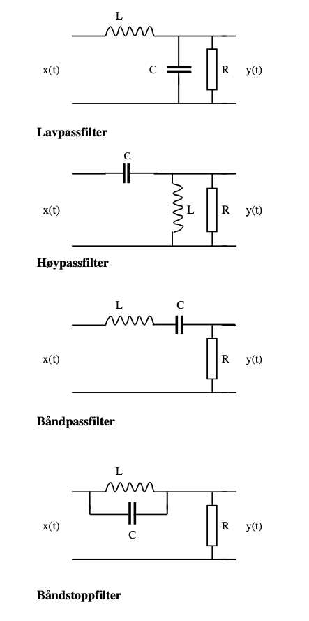

<!-- Generated by ipynb_to_quarto.py. Review before publication. -->
<!-- Source SHA-256: 2446c57d6caae4adf5d1b8a4492924a55c44feac21b7602acdf991e1f8275d5e -->

# Signalbehandling - Elektro

__Tiltenkte studieprogramer:__ BIELEKTRO, BIELSYS, BIELDIG

__Innleveringsfrist__: 3.mai kl. 12:00

__Innleveringsformat__: en pdf-fil

Har skal vi se på Laplacetransformasjon og anvendelser innenfor signalbehandling.

Det vil bli lagt ut noen øvinger som skal hjelpe med forståelse av Laplacetransformasjon. Disse er ikke obligatorisk, men anbefales da de vil hjelpe dere komme i gang med prosjektet.

## Oppgave 1: En differensialligning

La

$$
f(t) = 
\begin{cases}
 0 \quad & t< 0 \\
2t \quad & 0\leq t<1 \\
3-t \quad & 1\leq t < 2 \\
1 \quad & 2\leq t<4 \\
5-t \quad & 4\leq t<5 \\
0 \quad & t\geq 5
\end{cases}.
$$

a) Tegn grafen til funksjonen $f$ på intervallet $[0,7]$ med Python.

b) Finn Laplacetransformasjon $F(s)$ av funksjonen $f$ og tegn grafen med Python til funksjonen $F$ på intervallet $[0,7]$.

c) Løs differensialligningen:

$$
y'(t) + 2y(t) = f(t), \quad y(0^-)=0
$$

ved bruk av Laplacetransformasjon, og tegn grafen med Python til funksjonen $y$ på intervallet $[0,7]$.

## Oppgave 2: Seriekoblet RLC krets

Husk at en seriekoblet RLC-krets følger følgende differensialligning:

$$
\begin{pmatrix}
u'(t) \\
i'(t)
\end{pmatrix}
=
\begin{pmatrix}
-\frac{R}{L} & -\frac{1}{LC} \\
1 & 0
\end{pmatrix}
\begin{pmatrix}
u(t) \\
i(t)
\end{pmatrix}
+
\begin{pmatrix}
\frac{1}{L} v_s'(t) \\
0
\end{pmatrix}
$$

Hvor $i(t)$ er strømmen og $u(t)=i'(t)$ og $v_s(t)$ er spenningen.


#### a)
Løs ligningen med Laplace transformasjonen hvor $u(0)=i(0)=0$ (du kan velge passende konstante verdier til $R>0$, $L>0$, og $C>0$). Målet er å finne et utrykk for $i(t)$ som invers laplacetransformasjonen av et utrykk ikke avhengig av $v_s(t)$. 
#### b)
Velg spenningen $v_s(t)$ til en kjent ikke konstant funksjon og løs for $i(t)$.

## Oppgave 3: Filtrering:

Her finnes et diagram over ideelle og praktiske filter:


Hvordan skal vi få dette til? Vi prøver med en av disse kretsene:



Oppgaven din er altså å velge tre av filtrene. Deretter skal du for hvert av de tre valgte filtrenen:

a) Finne sprangresponsen.

b) Finne frekvensresponen.

c) Velg passende verdier til $R,L,C$ og tegn Bode-plottet i kodefeltet under.

```{python}
#| label: cell-9
#| echo: true
# Bodeplott til de tre valgte filtrene
```

## Oppgave 4: Telegrafistligning

#### Motivasjon for telegrafistligningen.
Dette er ikke så viktig for å løse ligningen, men en kort forklaring på hvor ligningen kommer fra. Dere vil mest sansynlig til å se denne ligningen i senere fag, så vi kommer ikke til å utlede likningen. For de som er interessert kan utledningen finnes her: https://www.youtube.com/watch?v=qFBr9xXloAc.

Som regel når vi arbeidar med kretser antar vi at potensialet $v$ forandre seg momentant igjennom kretsen når vi gjør endringer. For eksempel om vi sender et elektrisk strømsignal igjennom en internettkabel, antar vi at signalet blir mottatt i andre enden momentant. Samtidig ser vi vekk ifra resistansen, kapasiteten og induktansen til selve kabelen. 

Dette medfører at om $v(x, t)$ er spenningen i punktet $x$ i kabelen ved tiden $t$, har vi at $$v(0,t)=v(x_1,t),\quad v(L,t)=v(x_2,t).$$
Fra Ohm's lov vet vi at
$$i(x,t)=\frac{v(L, t)-v(0,t)}{R},$$
og er dermed uavhengig av posisjon.

Dette er kanskje en grei forenkling når lengden $L$ er liten. Derimot over lange avstander, som over atlanteren, vil ikke denne forenklingen fungere. Siden kabelen da er lang, vil for eksempel resistansen ha mer å si for hvordan spenningen forandrer seg igjennom kabelen samtidig som forandringen i spenning trenger tid for å bevege seg igjennom kabelen, siden den ikke kan gå over lysest hastighet.

## 


Om vi derimot om vi ønsker en mer realistisk likning for å beskrive dette tilfellet, må vi ta med forskjellige egenskaper til kabelen. La oss si at kabelen har følgende egenskapar:
* resistansen per lengde $R$ for kabelen målt i for eksempel $\mathrm{\Omega/km}$,
* kapasiteten per lengde $C$ for kabelen målt i for eksempel $\mathrm{nF/km}$,
* induktansen per lengde $L$ for kabelen målt i for eksempel $\mathrm{\mu H/km}$, og
* konduktivitet per lengde $G$ for kabelen målt i for eksempel $\mathrm{\mu S/km}$.

For oss er det ikke så viktig hva som er den fysiske betydingen til konstantene $R,\, C,\, L$ og $G$, det eneste som er viktig er at de er fikserte konstanter.

I punktet $x$ og ved tiden $t$ har vi at spenningen og strømmen oppfyller telegraflikningen
$$
\begin{cases}
v_x(x,t) = -Li_t(x,t)  - Ri(x,t),\\
i_x(x,t) = -Cv_t(x,t) -G v(x,t) .
\end{cases}$$

### a)
Vis at ligningen kan skrives på formen

$$
\vec{u}_x(x,t)= A\vec{u}_t(x,t)+B\vec{u}(x,t)
$$

hvor $$\vec{u}(x,t)=\begin{pmatrix}v(x,t)\\ i(x,t)\end{pmatrix}$$ og $A$ og $B$ er matriser.


### b)
La 

$$
F(x,s)=\mathcal{L}_t(f)(x,s)=\int_0^\infty f(x,t) e^{-st}\mathrm{d}t
$$

være laplacetransformen i tidsvariabelen. Noter 

$$
\vec{U}(x,s)=\begin{pmatrix}\mathcal{L}_t(v)(x,s)\\ \mathcal{L}_t(i)(x,s)\end{pmatrix}=\begin{pmatrix}V(x,s)\\ I(x,s)\end{pmatrix}.
$$
Finn laplacetransformen av ligningen i oppgave 4a hvor vi antar at $\vec{u}(x,0)=0$.

### Harmonisk respons

Ut i fra svaret på b) skal dere ha kommet fram til et uttrykk på formen 
$$
\frac{\partial}{\partial x}
\begin{pmatrix}
V(x,s) \\ I(x,s)
\end{pmatrix}
=
M(s)
\begin{pmatrix}
V(x,s) \\ I(x,s)
\end{pmatrix},
$$ hvor M er en (2 x 2)-matrise.

La strøm og spenning i avsenderenden være sinusvarierende med frekvens $\omega$, dvs. $v(0,t)=A\sin(\omega t)$ og $i(0,t)=B\sin(\omega t)$. Vi ser bare på **stasjonære forhold** $ (t\rightarrow \infty)$.  

Da kan vi sette $s=j\omega$, og samtidig representere strøm og spenning som visere (vektorer).

Likningen endres da til
$$
\frac{\partial}{\partial x}
\begin{pmatrix}
\mathbf{V}(x,\omega) \\ \mathbf{I}(x,\omega)
\end{pmatrix}
=
M(j\omega)
\begin{pmatrix}
\mathbf{V}(x,\omega) \\ \mathbf{I}(x,\omega)
\end{pmatrix},
$$
hvor 
$$\begin{pmatrix}
\mathbf{V}(x,\omega) \\ \mathbf{I}(x,\omega)
\end{pmatrix}=\begin{pmatrix}
V(x,j\omega) \\ I(x,j\omega)
\end{pmatrix}.$$

Dette kan betraktes som et system av homogene 1.ordens ODE'er med hensyn på $x$.

### c)

Finn den generelle løsningen av likningssettet ved hjelp av egenverdiene og egenvektorene til matrisen $M(j\omega)$.

For at svaret skal bli litt ryddigere kan dere sette $Z = R+j\omega L $ (**serieimpedans** pr. km) og
$Y = G+j\omega C $ (**shuntadmittans** pr. km).

Deretter kan vi innføre $\gamma = \sqrt{YZ} \,$ (**forplantningskonstant**) og 
$Z_c = \sqrt{\dfrac{Z}{Y}} \,$ (**karakteristisk impedans**).


### d)

Finn den stasjonære løsningen innsatt initialbetingelsene  $\, 
\vec{\mathbf{U}}(0,\omega)= 
\begin{pmatrix}
\mathbf{V}_s\\
\mathbf{I}_s
\end{pmatrix}.
$
