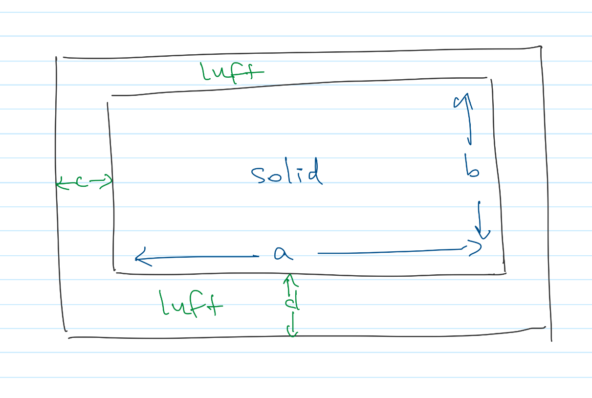

<!-- Generated by ipynb_to_quarto.py. Review before publication. -->
<!-- Source SHA-256: b757e620ddd24c22f20fe45bdd26746a31662a47db78624375a8487c3b192118 -->

# B - Diffusjon og steking

## Oppgave 1: Bevaringslover og Ficks lover

Ficks lover (https://no.wikipedia.org/wiki/Ficks_diffusjonslover) forklarer diffusjon som en bevaringslov med en spesielle type fluks.

En bevaringslov tar formen

$$
\frac{\partial\varphi}{\partial t} + \frac{\partial J}{\partial x} = 0,
$$

hvor $J(\varphi,x,t)$ er fluks av stoffet $\varphi$. Formen til $J$ bestemmes ut fra en fysisk modell. Noen viktiger eksempler:

1. $J = a\varphi$ hvor $a$ er en konstant.
2. $J = a\varphi^2$.
3. $J = a\frac{\partial\varphi}{\partial x}$

I flere situasjoner har vi til og med en kombinasjon av alle 3, dvs

$$
J = a_1 \varphi + a_2 \varphi^2 + a_3\frac{\partial\varphi}{\partial x}
$$


### a)
Ficks først diffusjonslov sier at $J$ tar en av formene over. Hvilken?

### b)
Ficks andre diffusjonslov gir ligningen som følger fra $J$ og bevaringsloven. Hva blir den?

### c)
Hva representerer isåfall flukser av type 1 og 2? Oppgi situasjoner vår de ville vært passende.

### d)
Hva med den siste muligheten, dvs en summen av alle tre? Når gjelder den? Tror du at systemet vil oppføre seg mest som 1, 2 eller 3? Eller kommer det an på andre faktorer? 

### e)
Forklar hvorfor en bevaringslov for et stoff $F(x,y,t)$ med 2 dimensjoner tar formen

$$
\frac{\partial F}{\partial t} + \frac{\partial I}{\partial x} + \frac{\partial J}{\partial y}= 0,
$$

hvor fluksen $\vec{J} = (I, J)$ oppgis i henholdsvis $x-$ og $y-$ retninger.

## Løsning

### a)

Ficks er nummer 3

### b)

Vi får da

$$
\frac{\partial\varphi}{\partial t} = - \frac{\partial}{\partial x} a\frac{\partial\varphi}{\partial x} = -a\frac{\partial^2\varphi}{\partial x^2}
$$

### c)

Nummer 1 er lineær adveksjon/konveksjon/transport, f eks masstransport i en stadig strøm. Nummer 2 er ikke lineær, for farten er avhengig av konsentrasjon, f eks momentumtransport i en væske (gir dermed hastighet)

### d)

Da får vi en blanding, f eks varmetransport som skyldes både konveksjon og diffusjon. Hvordan systemet oppfører seg kommer an på de relative størrelsene av a1, a2, og a3. Men legg merke til at $a3=0$ er noe annet enn $a3\rightarrow 0$, gitt den kraftige utjevning av diffusjon.

### e)

Vi setter opp en liten rektangel av areal $\delta x \delta y$: endring i tid av $F$ er $\frac{\partial I}{\partial x}$ for fluks over randene parallelt med $y$-aksen, og $\frac{\partial J}{\partial y}$ over randene parallelt med $x$-aksen, osv.

## Oppgave 2: Varmeledning

Fouriers lov sier at varmefluks som skyldes varmeldning tar formen

$$
\vec{J} = -\kappa\nabla T,
$$

hvor $\nabla T$ er gradient i temperatur. Anta forresten at vi har en konstant spesifikk varmekapasitet

$$
c_p = \frac{1}{\rho V}\frac{dQ}{dT},
$$

hvor $Q$ er varmen (en form for energi) og $T$ er temperatur (en tilstand av et stoff). Tettheten $\rho$ og volumet $V$ antas også konstant.

### a)

Forklar hvorfor ligningen

$$
u_t = \frac{\kappa}{c_p\rho}(u_{xx} + u_{yy}),
$$

kalles for *varmeligningen* (altså, utled den under de overnevnte antakelsene)

### b)

En vanlig form for varmetransport er konveksjon, hvor for eksempel temperaturforskjeller i luften nær en panelovn fører til luftsirkulasjon. Hvorvidt er varmeligning egnet til denne situasjonen? Tenk bare på 1 dimensjon, og bruk svarene dine fra oppgave 1.

## Løsning

### a)

Vi utleder i en dimensjon. 

$$
J = -\kappa \left(\frac{\partial T}{\partial x},\frac{\partial T}{\partial y}\right)
$$

og dermed

$$
\frac{\partial T}{\partial t} = \frac{1}{c_p \rho} \frac{\partial Q}{\partial t}
$$

Siden bevaringsloven for $Q$ med fluks $J$ er

$$
\frac{\partial Q}{\partial t} = -\frac{\partial J_x}{\partial x} - \frac{\partial J_y}{\partial y}
$$

Får vi
$$
\frac{\partial T}{\partial t} = \frac{1}{c_p \rho} \kappa \left( \frac{\partial^2 T}{\partial x^2}
+ \frac{\partial^2 T}{\partial y^2} \right)
$$


### b)

Se svaret fra 1d), transport av luft følger ligninger som har også (ikke-lineær) konveksjon


## Oppgave 3: Poissonligning, 1D

Nå skal vi varme opp med å øve på flere relevante ligninger, før vi slipper oss løs på en modell av steking i en ovn.

Vi begynner med å se på ligningen
$$
u''(x) = f(x), \quad -1<x<1
$$

Vi velger $f(x)=\cos(\pi x)$

### a)

Løs ligningen analytisk for Dirichlet randbetingelsene $u(-1) = 0, u(1) = 2$.

### b)

Finn en numerisk løsning. Stemmer de overens?

### c)

Løs ligningen analytisk for Neumann randbetingelser $u'(-1) = 1, u'(1) = 1$

### d)

Finn en numerisk løsning på samme ligning

## Løsning

1. Vi løser ved å integrere to ganger:

$$
u'(x) = -\frac{1}{\pi}\sin(\pi x) + a
$$

og

$$
u(x) = -\frac{1}{\pi^2}\cos(\pi x) + ax + b
$$

Siden $\cos(\pm\pi)= -1$, vi har

$$
\begin{align*}
u(-1) = \frac{1}{\pi^2} - a + b &= 0 \\
u(1) = \frac{1}{\pi^2} + a + b &= 2
\end{align*}
$$

Vi får $a=1$ ved å trekke den andre ligningen fra den første, og da er $b = 1 - \frac{1}{\pi^2}$.

$$
u = 1+x-\frac{1}{\pi^2}\big(1+\cos(\pi x)\big)
$$

2. Se under

```{python}
#| label: cell-9
#| echo: true
import scipy.sparse as sp
import scipy.sparse.linalg as lin
import matplotlib.pyplot as plt
import numpy as np

m=100

x = np.linspace(-1,1,m+2)

h=x[1]-x[0]

a = 0
b = 2

L = (1/h**2)*sp.diags([1,-2,1],[-1,0,1],shape=(m,m))

F = np.cos(np.pi*x[1:-1])

F[0] = F[0] - a/(h**2)
F[-1] = F[-1] - b/(h**2)

U = lin.spsolve(L,F)

def g(x):
    return 1 + x - (1/np.pi**2)*(1+np.cos(np.pi*x))

plt.plot(x[1:-1],U)
plt.plot(x[1:-1],g(x[1:-1]))
```

3. Vi har samme generelle løsning, men her er

$$
u'(x) = -\pi\sin(\pi x) + a,
$$

slik at $u'(-1) = u'(1) = a$. Vi må ha $a=1$, mens $b$ er ubestemt.

$$
u(x) = x - \pi^2\cos(\pi x) + b
$$

4. Se under

```{python}
#| label: cell-11
#| echo: true
m=4

x = np.linspace(-1,1,m+2)

h=x[1]-x[0]

L2 = (1/h**2)*sp.diags([1,-2,1],[-1,0,1],shape=(m+2,m+2))

L2 = sp.csr_matrix(L2)

L2[0,0] = -1/h
L2[0,1] = 1/h
L2[-1,-1] = 1/h
L2[-1,-2] = -1/h


G = np.cos(np.pi*x)

G[0] = 1
G[-1] = 1


def g2(x):
    return x - (1/np.pi**2)*(np.cos(np.pi*x))

v, istop, itn, r1norm = lin.lsqr(L2, G)[:4]


plt.plot(x,v)
plt.plot(x,g2(x))
```

## Oppgave 4: Varmeligning, 1D

Vi løser nå varmeligningen

$$
u_t = u_{xx} - f(x), \quad t\geq 0, -1<x<1
$$

Vi velger igjen $f(x)=\cos(\pi x)$, og initialbetingelsene

$$
u(x,0) = 1 + x + 5\sin(\pi x)
$$

### a)

Løs ligningen for Dirichlet randbetingelsene $u(-1)=0, u(1)=2$.

### b)

Løs ligningen for Neumann randbetingelsene $u'(-1)=-1, u'(1)=1$.

Velg enten forlengs Euler (med passende tidslengde) eller baklengs Euler.

## Løsning

### a)

Se under

```{python}
#| label: cell-14
#| echo: true
import matplotlib.pyplot as plt
import numpy as np

m=100

x = np.linspace(-1,1,m+2)

h=x[1]-x[0]

a = 0
b = 2

L = (1/h**2)*sp.diags([1,-2,1],[-1,0,1],shape=(m,m))

F = np.cos(np.pi*x[1:-1])

F[0] = F[0] - a/(h**2)
F[-1] = F[-1] - b/(h**2)

def euler(f,x0,a,b,N):
    t = np.linspace(a,b,N)
    x = np.zeros((N,x0.size))
    x[0,:] = x0
    for i in np.arange(N-1):
        x[i+1,:] = x[i,:] + (t[i+1]-t[i])*(f(x[i],t[i]))
    return x,t

def f(x,t):
    return L @ x - F

u0 = 1 + x[1:-1] + 5*np.sin(np.pi*x[1:-1])

u, t = euler(f, u0, 0, 1, 10000)

fig, ax = plt.subplots()

ax.plot(x[1:-1],u[1000,:])
ax.plot(x[1:-1],u[3000,:])
ax.plot(x[1:-1],u[5000,:])
```

### b)

Se under.

Legg merke til at vi går ikke mot likevekt, siden den ikke eksisterer - den tilsvarende Poissonligning har ingen løsninger.

```{python}
#| label: cell-16
#| echo: true
m=50

x = np.linspace(-1,1,m+2)

h=x[1]-x[0]

L2 = (1/h**2)*sp.diags([1,-2,1],[-1,0,1],shape=(m+2,m+2))

L2 = sp.csr_matrix(L2)

L2[0,0] = -1/h
L2[0,1] = 1/h
L2[-1,-1] = 1/h
L2[-1,-2] = -1/h


G = np.cos(np.pi*x)

G[0] = 1
G[-1] = 1


def g(x,t):
    return L2 @ x - G

u0 = 1 + x + 0.5*np.cos(np.pi*x)

u, t = euler(g, u0, 0, 2, 10000)

fig, ax = plt.subplots()

ax.plot(x,u[1000,:])
ax.plot(x,u[3000,:])
ax.plot(x,u[5000,:])
```


## Oppgave 5: Poissonligning, 2D

Nå skal vi se på numeriske løsninger av Poissonligningen i 2 dimensjoner

$$
u_{xx} + u_{yy} = f(x,y), \quad -5<x<5, 0<y<2.
$$

Vi velger $f=0$ og følgende ranbetingelsene:

$$
\begin{align}
u(-5,y) = \sin(2\pi y), \quad & 0\leq y \leq 2 \\
u(x,0) = 0, \quad & -5\leq x \leq 5 \\
u(5,y) = \sin(2\pi y), \quad & 0\leq y \leq 2 \\
u(x,2) = \sin(\pi x), \quad & -5 \leq x \leq 5
\end{align}
$$

### a)

Løs ligningen numerisk.

::: {.callout-warning title="Mulig kodeoppgave"}
Kodecelle 19 følger en oppgavetekst og kan vurderes for `py-exercise` eller en interaktiv Pyodide-celle.
:::

::: {.callout-warning title="Mulig løsningscelle"}
Kodecelle 19 er merket eller formulert som en mulig løsning. Vurder å flytte den til lærermaterialet.
:::

```{python}
#| label: cell-19
#| echo: true
m=100

x=np.linspace(-5,5,m+2)
h=x[1]-x[0]

L1 = (1/h**2)*sp.diags([1,-2,1],[-1,0,1],shape=(m,m))
I1 = sp.eye(m)

n=100

y=np.linspace(0,2,n+2)
k = y[1]-y[0]

L2 = (1/k**2)*sp.diags([1,-2,1],[-1,0,1],shape=(n,n))
I2 = sp.eye(n)

A = sp.kron(L1,I2) + sp.kron(I1,L2)

# Randbetingelsene

Zm_l = np.zeros(m)
Zm_l[0] = -1/(h**2)

Zm_r = np.zeros(m)
Zm_r[-1] = -1/(h**2)

Zn_l = np.zeros(n)
Zn_l[0] = -1/(k**2)

Zn_r = np.zeros(n)
Zn_r[-1] = -1/(k**2)

def f1(x):
    return np.sin(np.pi*x)

def f2(x):
    return 0*x

def f3(y):
    return 0*y

def f4(y):
    return np.sin(2*np.pi*y)

F = sp.kron(f2(x[1:-1]),Zn_l) + sp.kron(f1(x[1:-1]),Zn_r) + sp.kron(Zm_l,f4(y[1:-1])) + sp.kron(Zm_r,f4(y[1:-1]))

# Løsning

u = lin.spsolve(A,np.transpose(F))

#print(A.shape)
#print(F.shape)

U = np.reshape(u,(m,n))

X, Y = np.meshgrid(x[1:-1],y[1:-1])

#import matplotlib as mpl
import matplotlib.pyplot as plt
from matplotlib import cm

#levels = np.linspace(np.min(Z), np.max(Z), 7)

fig,ax2 = plt.subplots(subplot_kw ={"projection":"3d"}, figsize=(15,15))

ax2.plot_surface(np.transpose(X), np.transpose(Y), U) #vmin=Z.min() * 2, cmap=cm.Blues)

plt.show()
```

## Oppgave 6: Varmeligning, 2D

Nå skal vi modellere steking av et gjenstand i en ovn.



$$
u_t = \alpha(u_{xx} + u_{yy}),
$$

hvor $\alpha=\frac{\kappa}{c_p \rho}$, med $\kappa$ termisk konduktivitet, $\rho$ massetetthet og $c_p$ spesifikk varmekapasitet. Passende tall kan slås opp på nett.

Vi antar at temperaturen av luft i ovnen holdes konstant på 200 grader hele tiden, og bruker altså randbetingelsene at $u(x,y)=200$ på alle randene.

### a)

Velg et gjenstand å steke. Finn et passende tall for $\alpha$.

### b)

Hvor lang tid tar det før temperaturen i midten av legemet når 60 grader?

### c)

Hvor lang tid tar det før temperaturen ved rander overstiger 60 grader? Er det realistisk?


### d)

Legg ved noen "varmeplotter" av legemet etter en viss tid.

## Løsningen

Alpha vil variere etter hva som er valgt. Har bare tatt alpha=1 her, det endres lett i koden.

::: {.callout-warning title="Mulig løsningscelle"}
Kodecelle 22 er merket eller formulert som en mulig løsning. Vurder å flytte den til lærermaterialet.
:::

```{python}
#| label: cell-22
#| echo: true
import matplotlib.animation as animation

from IPython.display import HTML

m=50

alpha=1

a = 2
b = 3

x=np.linspace(-a,a,m+2)
h=x[1]-x[0]

L1 = alpha*(1/h**2)*sp.diags([1,-2,1],[-1,0,1],shape=(m,m))
I1 = sp.eye(m)

n=50

y=np.linspace(-b,b,n+2)
k = y[1]-y[0]

L2 = alpha*(1/k**2)*sp.diags([1,-2,1],[-1,0,1],shape=(n,n))
I2 = sp.eye(n)

A = sp.kron(L1,I2) + sp.kron(I1,L2)

# Randbetingelsene

Zm_l = np.zeros(m)
Zm_l[0] = -1/(h**2)

Zm_r = np.zeros(m)
Zm_r[-1] = -1/(h**2)

Zn_l = np.zeros(n)
Zn_l[0] = -1/(k**2)

Zn_r = np.zeros(n)
Zn_r[-1] = -1/(k**2)

def ute(x):
    return 200

ute = np.vectorize(ute)

F = sp.kron(ute(x[1:-1]),Zn_l) + sp.kron(ute(x[1:-1]),Zn_r) + sp.kron(Zm_l,ute(y[1:-1])) + sp.kron(Zm_r,ute(y[1:-1]))

# Løsning

def f(x,t):
    return A @ x - F

X, Y = np.meshgrid(x[1:-1],y[1:-1])

u0 = 20 + np.zeros(m*n)

u, t = euler(f, u0, 0, 1, 5000)

#fig,ax2 = plt.subplots(subplot_kw ={"projection":"3d"}, figsize=(15,15))

#Z = np.reshape(u[100,:],(m,n))

#ax2.plot_surface(np.transpose(X), np.transpose(Y), Z) #vmin=Z.min() * 2, cmap=cm.Blues)

#plt.show()

#fig, ax1 = plt.subplots(figsize=(15,10))

#pos = ax1.imshow(-Z,cmap='RdBu',interpolation='none')

#fig.colorbar(pos,ax=ax1)

fig, ax = plt.subplots(figsize=(15,10))

ims = []
for i in range(40):
    im = ax.imshow(-np.reshape(u[100*i,:],(m,n)),cmap='RdBu', animated=True)
    if i == 0:
        ax.imshow(-np.reshape(u[0,:],(m,n)),cmap='RdBu')  # show an initial one first
    ims.append([im])

ani = animation.ArtistAnimation(fig, ims, interval=50, blit=True,
                                repeat_delay=1000)

HTML(ani.to_jshtml())
```

## Oppgave 7: Luften skal med

Våre antagelse at temperaturen i luften holdes konstant ved 200 grader er ikke realistisk. I realitet vil temperatur senke når en kaldere objekt tas inn i ovnen. I tilfelle vil det oppstå konveksjon, siden luft er en fluid.

Vi vil ignorere konveksjon, men her er et forslag til en (litt) bedre modell: vi antar at luften holder en konstant temperatur over en viss avstand (i diagrammet $c,d$) fra objektet som stekes, men modellerer luften som er nærmere med en varmeligning

$$
u_t = \alpha( u_{xx} + u_{yy} ),
$$

hvor $\alpha$ tar et annet, lavere verdi (gjerne noen som passer til luft).

La oss prøve på nytt!

### a)

Hvor lang tid tar det før temperaturen i midten av legemet når 60 grader?

### b)

Hvor lang tid tar det før temperaturen ved rander overstiger 60 grader? Er det realistisk?

### c)

Prøv å endre størrelsen på mengde luft som modelleres med varmeligningen. Hvordan påvirker det resultatene over?

## Løsning

Har ikke valgt verdier av alpha her, annet enn $\alpha=1$ på innsiden, og $\alpha=0.1$ på utsiden. Man ser tydelig at desto tykkere luftlaget blir, desto treigere går diffusjonen.

::: {.callout-warning title="Mulig løsningscelle"}
Kodecelle 26 er merket eller formulert som en mulig løsning. Vurder å flytte den til lærermaterialet.
:::

```{python}
#| label: cell-26
#| echo: true
import matplotlib.animation as animation

from IPython.display import HTML

m=50

a = 2
b = 3

# hvor tykt er luftlaget
c = 0.5

x=np.linspace(-a-c,a+c,m+2)
h=x[1]-x[0]

m1 = int(c/h)


n=50

# hvor tykt er luftlaget
d = 0.5

y=np.linspace(-b-d,b+d,n+2)
k = y[1]-y[0]

n1 = int(d/k)

alpha_gas = 0.1

alphas_m = np.ones(m)
alphas_n = np.ones(n)

alphas_m[:m1]=alpha_gas
    
alphas_m[-m1:]=alpha_gas
    
alphas_n[:n1]=alpha_gas

alphas_n[-n1:]=alpha_gas

B1 = sp.diags(alphas_m)
B2 = sp.diags(alphas_n)

L1 = (1/h**2)*B1 @ sp.diags([1,-2,1],[-1,0,1],shape=(m,m))
I1 = sp.eye(m)

L2 = (1/k**2)*B2 @ sp.diags([1,-2,1],[-1,0,1],shape=(n,n))
I2 = sp.eye(n)

A = sp.kron(L1,I2) + sp.kron(I1,L2)

# Randbetingelsene

Zm_l = np.zeros(m)
Zm_l[0] = -1/(h**2)

Zm_r = np.zeros(m)
Zm_r[-1] = -1/(h**2)

Zn_l = np.zeros(n)
Zn_l[0] = -1/(k**2)

Zn_r = np.zeros(n)
Zn_r[-1] = -1/(k**2)

def ute(x):
    return 200

ute = np.vectorize(ute)

F = sp.kron(ute(x[1:-1]),Zn_l) + sp.kron(ute(x[1:-1]),Zn_r) + sp.kron(Zm_l,ute(y[1:-1])) + sp.kron(Zm_r,ute(y[1:-1]))

# Løsning

def f(x,t):
    return A @ x - F

X, Y = np.meshgrid(x[1:-1],y[1:-1])

u0 = 20 + np.zeros(m*n)

u, t = euler(f, u0, 0, 1, 5000)

#fig,ax2 = plt.subplots(subplot_kw ={"projection":"3d"}, figsize=(15,15))

#Z = np.reshape(u[100,:],(m,n))

#ax2.plot_surface(np.transpose(X), np.transpose(Y), Z) #vmin=Z.min() * 2, cmap=cm.Blues)

#plt.show()

#fig, ax1 = plt.subplots(figsize=(15,10))

#pos = ax1.imshow(-Z,cmap='RdBu',interpolation='none')

#fig.colorbar(pos,ax=ax1)

fig, ax = plt.subplots(figsize=(15,10))

ims = []
for i in range(40):
    im = ax.imshow(-np.reshape(u[100*i,:],(m,n)),cmap='RdBu', animated=True)
    if i == 0:
        ax.imshow(-np.reshape(u[0,:],(m,n)),cmap='RdBu')  # show an initial one first
    ims.append([im])

ani = animation.ArtistAnimation(fig, ims, interval=50, blit=True,
                                repeat_delay=1000)

HTML(ani.to_jshtml())
```

```{python}
#| label: cell-27
#| echo: true

```

## Oppgave 8: Analytiske løsninger (Avsluttend uke)

### a)

Løs ligningen fra oppgave 5 med separasjon av variabler og sammenlign resultatet med dine simuleringer.

### b)

Hvor nøyaktig var simuleringene?

### c)

Undersøk forhold mellom tiden brukt på simulering (f eks gjennom antall punkt i gitteret) og nøyaktighet.

### d)

Hvor nøyaktig tror du det er det realistisk å få simuleringen på en vanlig laptop?

## Løsning

### a)

Generelle løsninger er av formen

$$
u = F(x)G(y) = (A_n \sinh n\pi x + B_n \cosh n\pi x) (C_n \sin n\pi y + D_n \cosh n\pi y)
$$

eller omvendt, altså med hyperbolske funksjoner i $y$ og vanlige trigonometriske i $x$. For å oppnå randbetingelser må vi ha et ledd

$$
\sin(2\pi y) (A_n \sinh 2\pi x + B_n \cosh 2\pi x)
$$

og et annet

$$
\sin(\pi x)(C_n \sinh \pi y + D_n \cosh \pi y)
$$

For det første, vi trenger $F(-5) = F(5) = 1$, som gir $A_n=0$ og $B_n = \frac{1}{\cosh 10\pi}$.

For det andre, vi trenger $G(0)=0$ og $G(2)=1$, som gir $D_n=0$ og $C_n=\frac{1}{\sinh 2\pi}$. Vi får altså

$$
u(x,y) = \frac{\cosh 2\pi x \sin 2\pi y}{\cosh 10\pi} + \frac{\sinh \pi y \sin \pi x}{\sinh 2\pi}
$$

### b)

Det vil være avhengig av gitteret, og til en viss grad også hvilken norm feilen måles i.

### c)  

En typisk nøyaktighet er $\mathcal{O}(kh)$, dvs feilen er typisk i direkt forhold til antall punkter i gitteret.

Tiden er litt komplisert. En naiv implementering av løsning av et system skalerer med $\mathcal{O}(n^3)$, hvor $n$ er antall punkter i gitteret. 

Bruk av en bedre løser kan få det ned til $\mathcal{O}(n\log n)$ (FFT-basert), muligens $\mathcal{O}(n)$ for de beste multigrid metoder.

### d)

Det kommer begrensinger på både løsning av systemet og kondisjonering av systemet.

På min laptop får jeg ned til cirka $10^{-5}$ i $L^{\inf}$ med å bruke den vanlig sparse lineært system løser.

```{python}
#| label: cell-30
#| echo: true

```
