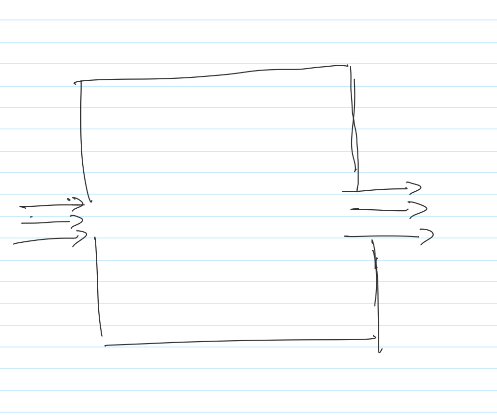
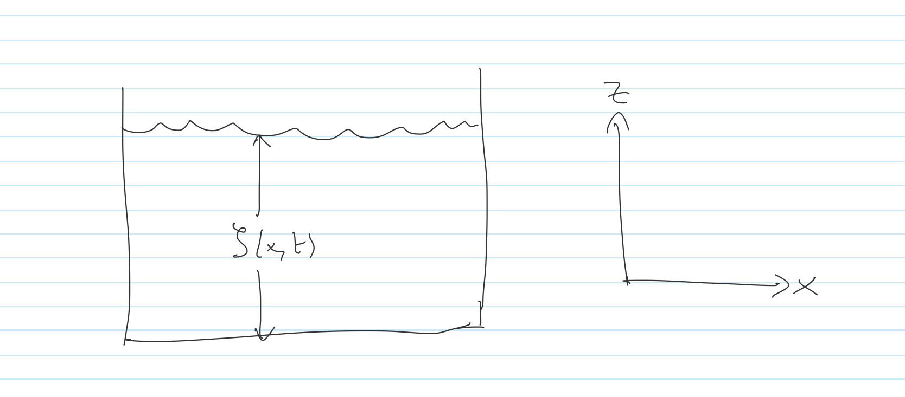

<!-- Generated by ipynb_to_quarto.py. Review before publication. -->
<!-- Source SHA-256: 2c34c67c402c01f8cd17d4199b85609ef725e7c132d1d3c7473374cb35c6fa5a -->

# B2 - Vannbølger
__Tiltenkte studieprogramer:__ BIForen, BIHAV, 699SD

__Innleveringsfrist__: 3.mai kl. 12:00

__Innleveringsformat__: en pdf-fil

## Innføring i Fluidmekanikk

Tilstand til et stoff (som vann, luft osv) i likevekt beskrives av to termodynamiske variabler, for eksempler tetthet $\rho$ og trykket $p$.

Erfaringen sier at fluider er sjelden i likevekt. Det håndteres stort sett sånt:

1. Tetthet $\rho(\vec{x},t)$ og trykket $p(\vec{x},t)$ varierer i både tid og rom
2. Forflytting beskrives av et *hastighetsfelt* $\vec{u}(\vec{x},t)$, også avhengig av tid og rom.

Generelt finner vi $\rho, p, \vec{u}$ ved å løse partielle differensialligninger. Men først, litt om hva $\vec{u}$ egentlig sier, dvs hva vi mener når vi snakker om et "hastighetsfelt"

## Hastighetsfelt (kinematikk)

Hastighetsfeltet $\vec{u}(\vec{x},t)$ beskriver endring av posisjon til en partikkel som befinner seg ved punkt $\vec{x}$ på tid $t$. Med andre ord, en partikkel som befinner seg i $\vec{x}_0$ ved tid $t=0$ følger en ordinær differensialligning:

$$
\frac{d}{dt}\vec{x}(t) = \vec{u}\big(\vec{x}(t),t\big), \quad \vec{x}(0) = \vec{x}_0
$$

## Eksempel: partikkel i et gitt felt

La

$$
\vec{u}(\vec{x},t) = A\vec{x}, \quad A = \begin{pmatrix}
0 & 1 \\
-1 & 0
\end{pmatrix}
$$

Da følger en partikkel $\vec{x}(t)$ som begynner ved $\vec{x}(0) = (1,0)$

$$
\vec{x}(t) = \begin{pmatrix}
\cos(t) \\
\sin(t)
\end{pmatrix}
$$

## Eksempel: tetthet i et gitt felt

Tetthet og andre egenskaper vil også flytte seg med feltet. Tetthet av en *inkompressibel* væske følger følgende ligning:

$$
\frac{\partial \rho}{\partial t} + \frac{\partial \rho}{\partial \vec{u}} = 0
$$

For kjent $\vec{u}(\vec{x},t)$ er det altså en bevaringslov.

**Eksempel**

Antar nå at vi har en-dimensjon i rom. La $\vec{u}(x,t)=a$ være konstant. Tettheten følger den transportligning

$$
\frac{\partial \rho}{\partial t} + a\frac{\partial \rho}{\partial x} = 0.
$$

```{python}
#| label: cell-4
#| echo: true

```

## Oppgave 1: Fluidmekanikk


### a)

En partikkel $\vec{x}(t)$ beveger seg fra $\vec{x}(0) = (1,0)$ i det tidsavhengige feltet

$$
\vec{u}(\vec{x},t) = A(t)\vec{x}, \quad A(t) = \begin{pmatrix}
\cos(t) & \cos(t)+\sin(t) \\
-\sin(t) & 0
\end{pmatrix}
$$

Bruk Eulers metode (husk ProgNumSikk/Matte 1) til å spore posisjon til partikkelen over tid.

### b)

Antar den endimensjonal hastighet $\vec{u}(x,t)=2$. Hvis tettheten $\rho(x,0)=\frac{1}{1+x^2}$, hva er tettheten $\rho(x,t)$?

## 2. Dynamikk (hvordan finne hastigheten)

Ligningen for $\vec{u}$ er mer komplisert (du får en million dollar om du løser den... https://no.wikipedia.org/wiki/Millenniumprisproblem), og mer et tema for matematikk 3. 

Heldigvis er det ofte mulig å forenkle ligningene slik at de blir mer håndterlig. En måte er å anta at $\vec{u}$ er bare endimensjonalt, dvs den peker alltid i samme retning, og er kun avhengig av tid og posisjon langs aksen den beveger seg.

En liten smakbit på hvordan det funker i en dimensjon:

Grovt sett, ligningen for $u$ kommer fra en bevaringslov for *impuls*, $\rho u$, og i en dimensjon tar formen

$$
\frac{\partial u}{\partial t} + u\frac{\partial u}{\partial x} - \nu\frac{\partial^2 u}{\partial x^2} = -\frac{1}{\rho}\frac{\partial p}{\partial x}
$$

Hvis $\rho,p$ er kjent får vi en ligning som kombinerer både varmeligning og en (ikke-lineær) bevaringslov. Generelt er det konkurrende krefter:

1. Transport av impuls: $u\frac{\partial u}{\partial x}$ 
2. Dissipasjon fra viskositet: $-\nu\frac{\partial^2 u}{\partial x^2}$

Om 2 dominerer 1 kan vi faktisk bruke varmeligningen til å finne flyte: det heter *Stokes flow*.

Om 1 dominere 2 kan vi se bort fra viskositet og bruke bare bevaringsloven, da har vi *Eulers ligninger*.

Det er imidlertidig ikke alltid enkelt i dette tilfelle: det kan hende at selv om $\nu$ er veldig liten, at det kan fortsett ikke ignoreres i nærheten av en rand (ellers får vi ikke oppfylt randbetingelsene). Det kan vi se bort fra her.

## Oppgave 2: 

La oss anta at vi har konstant trykk $p$, slik at leddet på høyre siden over forsvinner, og vi får den såkalte (viskose) Burgers ligning:

$$
\frac{\partial u}{\partial t} + u\frac{\partial u}{\partial x} - \nu\frac{\partial^2 u}{\partial x^2} = 0
$$

La oss betrakte problemet hvor
$$
u(0,x) = \left\{
\begin{array}[cc]
& 2\quad & x<0 \\
0 \quad & x\geq 0
\end{array}
\right.
$$

### a)

Vis at ligningen løses av

$$
u(x,t) = \frac{2}{1+\exp\left(\frac{x-t}{\nu}\right)}
$$

### b)

Plott løsningen $u$ for forskjellige verdier av $\nu$. Hva skjer når $\nu\rightarrow 0$?

### c)

Sett opp en numerisk metode for ligningen basert på sentrale differanser i rom og forlengs Euler i tid. Bruk altså

$$
u_t(t_n,x_m) \approx \frac{u^{n+1}_m - u^n_m}{k}, \quad
u_x(t_n,x_m) \approx \frac{u^n_{m+1}-u^n_{m-1}}{2h}, \quad
u_{xx}(t_n,x_m) \approx \frac{u^n_{m+1}-2u^n_m + u^n_{m-1}}{h^2}
$$


### d)

Sammenlign den med Lax-Freidrichs metode på den ikke-viskøse ligning (med $\nu = 0$). Kan du finne en verdi for $\nu$ slik at de er like?

### e)

Sett $\nu = 0$ og løs ligningen med karakteristikker. Får vi sjokk? Tenk på grenseverdien $\nu\rightarrow 0$ i b) og kommenter samspill mellom viskositet og sjokk.

::: {.callout-warning title="Mulig kodeoppgave"}
Kodecelle 7 følger en oppgavetekst og kan vurderes for `py-exercise` eller en interaktiv Pyodide-celle.
:::

```{python}
#| label: cell-7
#| echo: true

```

## 3. Potentialflyte

Det virker som vi trenger stoff fra matte 3 til å se på alt annet en 1 dimensjon, som er veldig begrensende.

Heldigvis finnes det et spesielt tilfelle hvor vi kan finne $\vec{u}$ i flere dimensjoner ved hjelp av en skalar PDE, den kjente Laplaceligning (et spesielt tilfelle av Poissonligningen)!

Nå bruker vi det til å "oppgraderer" til flere dimensjoner i rom. Under gunstige forhold kan vi beskrive $\vec{u}$ med en skalar potentialfunksjon:

$$
u(x,y) = \nabla \phi,
$$

## Oppgave 3

Anta at vi er gitt

$$
\phi(x,y) = x \left( 1 + \frac{1}{x^2 + y^2} \right)
$$

### a)

Finn $\vec{u}$ og plott strømlinjer i feltet under.

### b)

Hva slags flyte representeres?

::: {.callout-warning title="Mulig kodeoppgave"}
Kodecelle 9 følger en oppgavetekst og kan vurderes for `py-exercise` eller en interaktiv Pyodide-celle.
:::

```{python}
#| label: cell-9
#| echo: true
x = np.linspace(-4, 4, 6)
y = np.linspace(-4, 4, 6)
X, Y = np.meshgrid(x, y)

# sett inn funksjonen

U, V = f(X,Y)


# plot
fig, ax = plt.subplots(figsize=(20,10))

ax.streamplot(X,Y, U, V)

plt.show()
```

## 4. Potentialflyte i en boks


Den store fordelen med å bruke en potential er at den oppfyller Laplaceligning

$$
\nabla^2 \phi = 0
$$

Randbetingelsene blir såkalte *Neumann* betingelser: vi oppgir $\frac{\partial \phi}{\partial\vec{n}}$ langs vegger med normalvektor 0. 

La oss anta at fluiden fyller en boks, med bare to inn- og ut- hull, hvor fluid kommer inn med kjent hastighet $a$ og ut med hastighet $b$.

Vi har da $\frac{\partial \phi}{\partial \vec{n}} = a$ eller $b$ ved åpningene, og ellers er $\frac{\partial \phi}{\partial\vec{n}} = 0$



## Oppgave 4

### a)

Løs ligningen numerisk for å finne $\phi$ 

### b)

Beregn $\phi_x$ og $\phi_y$ numerisk, og finn dermed $\vec{u}$.

### c)

Plott strømlinjer.

### d)

Hva kan du si om forholdet mellom $a,b$ og størrelsen på åpningene?

::: {.callout-warning title="Mulig kodeoppgave"}
Kodecelle 12 følger en oppgavetekst og kan vurderes for `py-exercise` eller en interaktiv Pyodide-celle.
:::

```{python}
#| label: cell-12
#| echo: true

```

## 5. Frie overflater og bølger


Vi får stort sett Neumann randbetingelser: $\frac{\partial \phi}{\partial \vec{n}} = 0$ ved veggene. Men overflaten er mer komplisert:

La oss anta at vi har bølger med høyde $z=\zeta(x,t)$. Vi får...

$$
\frac{\partial \phi}{\partial z} = \frac{\partial \zeta}{\partial t}\quad \mathrm{hvor}\quad z=0
$$

Siden randbetingelsene endrer med tid gjør også $\phi$. Det viser seg at

$$
\frac{\partial \phi}{\partial t} = g\zeta
$$



## Oppgave 5

Det er egentlig en koblet system for $\phi,\zeta$, men en numerisk løsning for begge er ganske vanskelig. Vi fokuserer på løsning av $\phi$ for en gitt $\zeta$. Vi antar at

$$
\zeta(x,t) = \cos\big(x-\sqrt{gh}t\big)
$$

For hver tid $t$ har vi altså en Poisson ligning for $\phi$.

### a)

Plott $\zeta(x,t)$. Ser det ut som en passende bølge?

### b)

Løs ligningen for noen utvalgte tider $t$

### c)

Plott tilsværende strømlinjer (altså $\nabla\phi$)

### d)

Kommenter resultatene. Ser de ut som bølger?

::: {.callout-warning title="Mulig kodeoppgave"}
Kodecelle 15 følger en oppgavetekst og kan vurderes for `py-exercise` eller en interaktiv Pyodide-celle.
:::

```{python}
#| label: cell-15
#| echo: true

```
