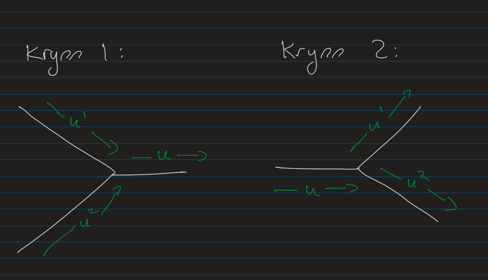

<!-- Generated by ipynb_to_quarto.py. Review before publication. -->
<!-- Source SHA-256: 24ecd7bd55449b20bee5f60dc3a145f03c916ce2eec2b6eee71838c92b0daa33 -->

# D - Transport og forsyningskjeder


__Tiltenkte studieprogramer:__ FTINGLOG

__Innleveringsfrist__: 3.mai kl. 12:00

__Innleveringsformat__: en pdf-fil


Vi kommer til å fokusere på modellering av trafikk på veger. Ikke bare er det et viktig logistikk-problem i seg selv, det er også tett tilknyttet til modellering av forsyningskjeder hvor det er forsinkelser mellom tiden en pakke sendes fra $A$ til $B$.

## Trafikkmodellering

I dette prosjektet skal vi se på trafikkmodellering. Det er flere måter å gå fram på for å modellere hvordan trafikken kan utvikle seg under forskjellige forhold. Her skal vi skal se på forenklede scenarioer der vi antar at alle biler i modellen befinner seg på en rett vei med en fil hvor ingen biler kjører ut fra veien og hvor ingen biler kommer inn på veien. Vi antar også det heller ikke er lov til å kjøre forbi biler foran seg.

Ideelt sett bør vi kanskje modellere trafikkflyt slik at vi kan beregne posisjonen til hver enkelt bil i modellen vår til enhver tid, der modellen vår er beskrevet av kjøreadferden til hver sjåfør. For eksempel kan noen være tregere med å starte opp når en kø løser seg opp enn det andre er, mens noen liker å kjøre fortere andre. Vi kan også tenke oss at noen liker å holde god avstand til bilen foran i en køsituasjon enn det andre liker. Trafikkmodeller som tar hensyn til slike faktorer er gjerne temmelig kompliserte, og i dette prosjektet skal vi gå fram på en litt annen måte.

## Utledning av trafikkligninga

I stedet for å følge hver enkelt bils posisjon skal vi beskrive trafikkflyten langs en 1-dimensjonal vei ved å bruke *biltettheten* $u(x,t)$ i posisjon $x$ ved tiden $t$ for å karakterisere hvordan trafikken utvikler seg. Vi vil også anta at alle sjåfører har samme kjøreadferd. Vi noterer oss at *enheten* til biltettheten $u$ er antall pr. meter.

I prinsippet  er det klart at biltettheten langs veien er $0$ mellom to biler, akkurat som massetettheten til en gass er $0$ i tomrommet mellom gassmolekyler. Allikevel bruker fysikerne massetettheten til en gass $\rho(x,y,z,t)$ som en kontinuerlig (og gjerne deriverbar) funksjon av sine variabler $(x,y,z,t)$ i klassisk fluiddynamikk. Altså er det klart $\rho(x,y,z,t)$ ikke betegner massetettheten til gassen på en *mikroskopisk skala*, men betegner et slags gjennomsnitt av massetettheten på en større skala.

## Oppgave 1: Biler og molekyler

Anta vi har en gass bestående av en type molekyler. 

1. Foreslå en formel for "gjennomsnittlig massetetthet i posisjon $(x,y,z)$", $\rho(x,y,z,t)$, der antall molekyler i en kule med radius $R>0$ og sentrum i $(x,y,z)$ inngår i formelen. I tillegg vil formelen inneholde massen $m$ til hvert enkelt molekyl.

I vår trafikkmodell antar vi at biltettheten $u(x,t)$ langs den 1-dimesjonale veien er definert på tilsvarende måte der vi har middlet tettheten av biler over intervallet $[-R+x,R+x]$ for å definere $u(x,t)$. Det er nokså tilfeldig hva $R$ velges som, kanskje $10$ billengder gir en passende middling for å definere $u(x,t)$.

2. Reflekter over hva som er konsekvensen for definisjonen av $u(x,t)$ ved å velge $R$ "liten" (si en billengde) eller velge $R$ "stor" (si $50$ billengder)

## Oppgave 2: Hastighet, fluks og tetthet

Vår grunnleggende antagelse i  trafikkmodellen vi skal se på er at hastigheten til bilene i posisjon $x$ ved tiden $t$ er en funksjon alene av biltettheten $u(x,t)$. Vi antar også at det er en konstant $u_m$ som angir maksimal biltetthet og at $v_m$ er den maksimale hastigheten bilene kan kjøre i.

1. Vi lar $v(u)$ betegne hastigheten bilene kjører i der det er biltetthet $u$.  Bør $v(u)$ være en voksende eller avtagende funksjon av $u\in [0,u_m]$?. Hva er rimelige verdier for $v(0)$ og $v(u_m)$? Bør $v(u)$ være kontinuerlig (besvares med sunn fornuft)? 

For en gitt veistandard og kjøreadferd burde det være mulig å *måle* eller estimere hva funksjon $v(u)$ er. I stedet skal vi postulere en klasse mulige funksjoner for hastigheten som funksjon av biltettheten $u$. En rimelig klasse funksjoner er
$$
v(u)=v_m(1-(\frac{u}{u_m})^p),
$$
der $p>0$ er en konstant parameter. 

2. Kan dere foreslå andre mulige fornuftige uttrykk for hastigheten som funksjon av biltettheten? Bruk fantasien og kjennskap til diverse funksjoner i matematikken.

Vi skal nå se på strømmen eller *fluksen* av biler i et punkt $x$ langs veien ved tiden $t$. Vi definerer fluksen av biler, $J(x,t)$, til å være antall biler som passer et punkt $x$ pr. tidsenhet. Altså har $J$ enhet antall pr. sekund).

3. Prøv å forklare med ord hvorfor fluksen er gitt ved

$$
    J(x,t)=J(u(x,t))=u(x,t)v(u(x,t)),
$$

der $v(u)$ er hastigheten bilene kjører i når det er biltetthet $u$. 

*En positiv hastighet $v$ tilsvarer kjøring fra venstre til høyre, altså økende $x$*.

## Oppgave 3: Utledning av ligningen

Antall biler som passerer punktet $x$ på veien i tidsintervallet $[t,t+\Delta t]$ er altså (tilnærmet lik)

$$
    J(x,t)\Delta t
$$

Videre er antall biler som befinner seg i intervallet $[x,x+\Delta x ]$ ved tiden $t$ gitt ved (tilnærmet) 

$$
    u(x,t)\Delta x
$$

Nå skal vi sette opp et regnskap for bilene som er helt analogt med det de fleste av oss har et forhold til. Vi vet at penger inn på konto minus penger ut av konto over et tidsrom er lik netto endring av saldoen.

Tilsvarende, er antall biler i intervallet $[x,x+\Delta x]$ ved tiden $t+\Delta t$ minus antall biler i $[x,x+\Delta x]$ ved tiden $t$ lik netto endring i antall av biler i $[x,x+\Delta x]$ i tidsrommet $t$ til $t+\Delta t$.

Analogt med bankkonto må dette matche antall biler som kjører inn i intervallet $[x,x+\Delta x]$ minus antall biler som kjører ut av $[x,x+\Delta x]$ i tidsrommet $t$ til $t+\Delta t$.


1. Uttrykk dette regnskapet matematisk, og vis at det fører til ligninga

$$
\frac{u(x,t+\Delta t)-u(x,t)}{\Delta t}=-\frac{J(x+\Delta x, t)-J(x,t)}{\Delta x}.
$$

2. Sjekk at venstre og høyre side av ligningen begge har samme fysiske enhet.


Som vanlig i denne type modellering ser vi på ligning over når $\Delta x\rightarrow 0$ og $\Delta t\rightarrow 0$.

3. Vis at ligningen over blir

$$
\frac{\partial u(x,t)}{\partial t}=-\frac{\partial J(x,t)}{\partial x}
$$

når $\Delta x \rightarrow 0$ og $\Delta t \rightarrow 0$.

Legg merke til at når vi deriverer en fysisk størrelse med hensyn på en fysisk variabel (sånn som $\frac{\partial J}{\partial x}$) endres enheten til $J$ ved at vi må dividere med enheten til $x$. Dvs. enheten til  $\frac{\partial J}{\partial x}$ er biler pr. tid pr. lengde.

## Oppgave 4: Løsninger av ligningen

Trafikkligning er en variant med en fartsgrense, og hvor farten til biler er avhengig av tetthet på vegen:

$$
u_t + f(u)_x = 0, \quad f(u) = u\cdot v(u)
$$

Vi tar 

$$
v(u) = v_m \left(1- \left(\frac{u}{u_m}\right)^p\right)
$$

1. Biler står foran et rødt lys. Vi har nemlig

$$
u(0,x) = \left\{
\begin{array}[cc]
& 1 \quad & x<0 \\
0 \quad & x\geq 0
\end{array}
\right.
$$

Løs ligningen for $p=1$ med karakteristikker.

2. Posisjon $x(t)$ til en tilfeldig bil som står ved $x=-1$ er gitt av

$$
\frac{dx}{dt} = v\big(u(x,t)\big), \quad x(0)=-1.
$$

Finn $x(t)$ og tegn det under. Ser det realistisk ut?

3. Bruk Lax-Friedrichs metode til å løse ligningen for andre verdier av $p$. Hvordan påvirker $p$ trafikkflyt? Hva tror du er mest realistisk? Vil en modell med bare formel-1 sjåfører ha større eller mindere verdi for $p$ enn en modell med vanlige hverdagssjåfører?

::: {.callout-warning title="Mulig kodeoppgave"}
Kodecelle 7 følger en oppgavetekst og kan vurderes for `py-exercise` eller en interaktiv Pyodide-celle.
:::

```{python}
#| label: cell-7
#| echo: true

```

## Oppgave 5: Kø

Det kan oppstå kø hvis tetthet av biler er høyere lengere ned veien (her når $x$ blir større). F eks, anta at vi har initial tetthet av form

$$
u(0,x) = \left\{
\begin{array}[cc]
&\rho_1 \quad & x\leq -1 \\
\rho_1 + (x+1)\rho_2 \quad & -1<x\leq 0 \\
\rho_2 \quad & 0<x
\end{array}
\right.
$$

1. Velg passende verdier til $\rho_1, \rho_2$

2. Tegn karakteristikkene.
3. Hvor lang tid går før sjokken når $x=-2$? Dvs, finn din minste tid $t$ slik at flere karakteristikker treffer $(-1,t)$.
4. Simuler systemet i kodefeltet under. Stemmer det overens med din forventning?

::: {.callout-warning title="Mulig kodeoppgave"}
Kodecelle 9 følger en oppgavetekst og kan vurderes for `py-exercise` eller en interaktiv Pyodide-celle.
:::

```{python}
#| label: cell-9
#| echo: true

```

## Oppgave 6: Kryss

Vi ser på to forskjellige typer kryss. Felles for de er at vi får forskjellige ligninger

$$
u_t + f(u)_x = 0, \quad f(u) = u\cdot v(u)
$$

for hver veg. I tillegg må randbetingelsene passer sammen. Vi ser hvordan det funker under.



1. Hva kan du si om fluksen ut- og inn- i veiene? Skriv ned en ligning som må oppfylles, for kryss 1.
2. Gjør det samme for kryss 2. *Hint: hvis det hjelper kan du skrive at en viss andel $\alpha$ av de som kjører inn i krysset velger veg $u^1$, mens $1-\alpha$ velger $u^2$*.
3. Hvorvidt er tettheten bestemt av fluksen? Dvs, hvor mange løsninger finnes til ligningen $f(u)=x$?
4. Implementere Lax-Friedrichs metode på kryss 2. Ta problemet "lyset går fra rødt til grønt". Hva slags randbetingelser ved overgangen trenger man i tillegg til informasjon om fluksen?
5. Prøv å Lax-Friedrichs metode på kryss 1 også. Funket det? Mest sannsynlig ikke - hvorfor tror du det oppstår problemer? Foreslå (men ikke implementer) en bedre løsning for randbetingelsene i krysset.

```{python}
#| label: cell-12
#| echo: true

```

## Kommentar: transport i en forsyningskjede

Vi kan sette opp et trafikk nettverk ut fra slike kryss og løse en trafikkligning på hver veg.

Det er ikke bare av interesse for trafikkplanlegging - også forsyningskjeder når varer må fraktes mellom forskjellige fabrikker, lagere og/eller ned produksjonslinjer følger en ligningende ligning.

Det blir imidlertig for mye arbeid for dette prosjekt å sette opp en stor slik modell, men vi håper at du er nå i stand til å forstå cirka hvordan det gjøres, og de viktigste egenskaper man ville forvente!
